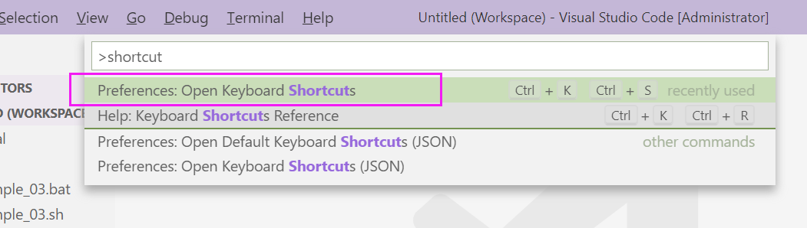

VSCode 使用教程
===============

:本节贡献者: |姚家园|\（作者）、
             刘珠妹（作者）、
             |赵志远|\（作者）、
             陈箫翰（审稿）、
             |田冬冬|\（审稿）
:最近更新日期: 2021-10-05
:预计花费时间: 60 分钟

.. warning::

   本节正在编写中，尚未完成。

Visual Studio Code，简称 VS Code ，是微软推出的一款免费、轻量且功能强大的编辑器。
VS Code 拥有一键执行、语法高亮、分屏显示等功能，是目前用于代码编程的主流编辑器。

VS Code 是跨平台软件，支持 linux/macOS/Windows 平台。本文以 windows 下编写 GMT 绘图脚本为例介绍其安装使用方法。
linux/macOS 下的安装过程则较为简单，可以参考\ :doc:`../../computer/setup`\ 中相应操作系统下的“日常软件”一节。

VS Code 安装
--------------

VS Code下载地址为： https://code.visualstudio.com/Download

安装中建议勾选下图中两项，目的是添加右键打开的快捷方式。

.. image:: vscode_pic1.png
   :width: 80%
   :align: center

安装完成之后有两种打开 VS Code的方式：

1. 开始菜单中，直接找到 Visual Studio Code 应用程序打开。
2. 直接在对应脚本或工作文件夹点击右键，选择 ``通过Code打开（Open with Code)`` 。

对于 windows 我们建议使用第二种方法，因为这样终端的工作目录会自动选定为代码文件所在的目录。
在 windows 中使用第一种方法打开代码文件后，还需要用户手动切换终端的工作目录，对于初学者来说十分麻烦。

插件安装
--------

为了便于编程开发调试，建议安装以下插件：

- **Code Runner** ： 支持脚本程序代码一键运行
- **vscode-pdf** ： pdf预览插件

插件安装方式：打开 **Extensions** 扩展插件菜单，搜索对应插件，点击安装。
安装成功之后， **Install** 图标将变为 **齿轮** ，可点击该齿轮，修改插件属性。
已安装启用的插件都可在 **Extension** 中查看设置。

Code Runner中需要设置终端输出：

在Extensions菜单中，点击Code Runner插件的 **齿轮** 图标，
弹出菜单中选择“ **Extension Settings** ”，勾选“ **Run in Terminal** ”。
另外勾选“ **Save File Before Run** ”，可在执行脚本之前先自动保存。

   
VS code 执行脚本程序过程
------------------------

在 VS code 中不能直接打开脚本文件，而是应该先打开某个文件夹作为工作区。
直接打开脚本文件将会造成终端运行工作目录与脚本所在目录不一致，从而导致诸多报错。
可以使用以下两种方式打开某个文件夹作为工作区：

- 在 VS code 中的Explore资源管理器菜单，选择 ``打开文件夹`` ：

- 或者，在文件夹上右键，选择 ``通过Code打开`` ：

.. image:: vscode_gif1.gif
   :width: 80%
   :align: center

含有中文的脚本需要设置编码为 ``GB2312`` ，否则会出现乱码：点击右下角的编码按钮，
再选择“ **重新打开编码（Reopen with Encoding）** ”，选择 ``中文简体GB2312`` 编码。

执行脚本可选择脚本页面右上方三角符号（Alt+F1），脚本运行信息显示在下方Terminal终端窗体。
若想同时预览生成结果，可增加编辑窗口（Split Editor），两个窗口分别显示脚本和运行结果。

.. image:: vscode_gif2.gif
   :width: 80%
   :align: center

若本机安装了Bash终端， VS code 也可识别并自动选择bash终端来执行bash脚本。也可通过手工切换，或多个终端切换执行：

.. image:: vscode_pic6.png
   :width: 80%
   :align: center
   
.. warning::

    请注意，在使用脚本进行GMT绘图时，如果你运行的是 Batch 脚本，请一定要在上图的“切换终端”中选择 cmd，绝对不要使用 PowerShell。
    PowerShell 运行 Batch 绘图脚本会出现无法使用远程数据、中文乱码等错误。
    
    如果你运行的是 bash 脚本，则必须在 ``gmt begin`` 之前添加一行 ``export GMT_SESSION_NAME=$$`` ，否则脚本运行将出现错误。
    详情请参阅 https://docs.gmt-china.org/latest/module/begin/#unix-shell

为提高编码效率，推荐使用快捷键进行代码注释、代码运行、窗格切换等操作。
键盘单击F1，调出 VS code 的命令面板，输入”shortcut“检索出快捷键编辑命令：

   
我们可以查询或自定义众多快捷键，包括但不限于行注释（Add Line Comment/Remove Line Comment）、
窗口分割（View: Split Editor Down/Right/Up/Left）、窗口关闭（View：Close Editor）等。

安装中文语言包
--------------

VS Code 的界面默认显示语言是英文，可以安装中文语言包。点击菜单栏“查看”后选择
“命令面板”（快捷键：:kbd:`Ctrl` + :kbd:`Shift` + :kbd:`p`），接着输入
“configure display language”并按 :kbd:`Enter` 键，然后选择“安装其他语言”。
这时界面会跳转到插件商店并自动搜索其他语言，一般第一个就是中文，
即 “Chinese (Simplified) Language Pack for Visual Studio Code”，点击安装就行了。
安装完之后自动重启，界面就变成中文了。

连接远程计算机
--------------

编辑远程计算机文件的传统方法是先使用 ssh 命令登录到远程计算机，然后在远程计算机中
使用 vim 编辑器编辑文件。

现在，我们可以借助 VS Code 扩展包 Remote - SSH，使用 VS Code 编辑远程文件，
这极大地提高编辑效率。这里简要介绍如何安装和使用该扩展包，可以参考 VS Code
官方文档 `ssh <https://code.visualstudio.com/docs/remote/ssh>`__ 了解详细用法。

1.  安装 Remote - SSH 扩展包

    在“扩展”中，搜索“Remote - SSH”，点击安装。

    安装完之后，左下角导航栏会多一个类似 ``><`` 的远程连接图标。之后可以通过
    点击该图标来使用该扩展包。

2.  配置远程计算机的 SSH 主机

    一般情况下，远程计算机已安装 SSH 服务器，本地计算机已安装 SSH 客户端。
    我们还需要配置基于密钥的认证，这也是 VS Code 官方推荐的认证方式。以下
    命令假设本地和远程计算机都是 Linux 或 macOS 系统，远程计算机的 IP 地址是
    192.168.1.100，用户在远程计算机中的用户名是 seismo-learn。
    可以参考 `SSH 教程：SSH 密钥登录 <https://wangdoc.com/ssh/key.html>`__
    进一步学习更详细的配置过程。

    本地计算机下，运行以下命令生成 SSH 密钥::

        $ ssh-keygen -t rsa -f ~/.ssh/id_rsa-remote-ssh

    该命令产生的一对 SSH 密钥分别位于 :file:`~/.ssh/id_rsa-remote-ssh` 和
    :file:`~/.ssh/id_rsa-remote-ssh.pub` 文件中。
    前者是私钥文件，不能泄露；后者是公钥文件，需要告诉远程计算机。

    运行以下命令将公钥复制到远程计算机中（需用户输入远程计算机的密码）::

        $ ssh-copy-id -i ~/.ssh/id_rsa-remote-ssh.pub seismo-learn@192.168.1.100

    该命令会把本地的公钥以追加的方式复制到远程计算机的 :file:`~/.ssh/authorized_keys`
    文件中，并给远程计算机中的用户家目录、:file:`~/.ssh` 目录以及 :file:`~/.ssh/authorized_keys`
    设置合适的权限。若远程计算机或本地计算机是 Windows 系统，请参考
    `Quick start: Using SSH keys <https://code.visualstudio.com/docs/remote/troubleshooting#_quick-start-using-ssh-keys>`__
    进行配置。

    在终端中输入以下命令，验证是否配置是否成功（即可以登录远程计算机）::

        $ ssh seismo-learn@192.168.1.100

3.  编辑远程文件

    点击左下角的远程连接图标，选择“Remote-SSH: Connect to Host”，输入
    seismo-learn@192.168.1.100 便可使用 VS Code 编辑远程计算机中的文件了。

4.  退出远程连接

    文件编辑完毕后，选择菜单栏“文件”中的“关闭远程连接”，或者直接关闭 VS Code，
    就可以退出远程连接。

.. tip::

    如果需要经常连接远程计算机，可以使用 SSH 配置文件。

    在活动栏中选择“远程资源管理器”，点击“配置”后选择 :file:`~/.ssh/config`
    配置文件，按照以下格式添加相关信息到该文件中::

        Host seismology
            User seismo-learn
            HostName 192.168.1.100
            IdentityFile ~/.ssh/id_rsa-remote-ssh

    第一列是关键词，如 Host、User、HostName、IdentityFile，第二列是对应的值。
    seismology 是用户自定义的远程主机标识，其他三个值同上文。可以按照该格式，
    向该文件中添加多个远程计算机。

    点击左下角的远程连接图标，选择“Remote-SSH: Connect to Host”，点击“seismology”
    就可以登录远程计算机了。也可以通过“远程资源管理器”，点击“seismology”登录远程计算机。

.. tip::

    如果远程计算机使用的 Shell 是 Bash，本地计算机是 Zsh，可能遇到无法启动
    VS Code 的终端的问题。此时，需要修改一下配置文件以正确启动终端。

    打开命令面板，输入 Remote-SSH: Settings，搜索 terminal.integrated.shell.linux，
    将 "/bin/zsh" 改为 "/bin/bash" 即可。详情请参考
    `microsoft/vscode-remote-release issues #38 <https://github.com/microsoft/vscode-remote-release/issues/38>`__
