# Fedora 配置指南

- 本节贡献者: {{田冬冬}}（作者）、{{姚家园}}（审稿）
- 最近更新日期: 2022-11-22
- 预计花费时间: 120 分钟

---

:::{note}
本节内容适用于 **Fedora 37 Workstation**，不一定适用于其他 Fedora 版本。
建议用户访问 [Fedora 官网](https://getfedora.org/) 下载并安装 Fedora
最新版本，也欢迎用户帮助我们更新本文以适配 Fedora 最新版本。
:::

## 安装系统

### 下载系统镜像

访问 [Fedora 官网](https://getfedora.org/) 并下载 Fedora Workstation 镜像文件，
一般选择 x86_64 版本。

**Fedora 37 Workstation x86_64** 的 ISO 镜像文件（约 2 GB）下载链接：

- [官方镜像](https://download.fedoraproject.org/pub/fedora/linux/releases/37/Workstation/x86_64/iso/Fedora-Workstation-Live-x86_64-37-1.7.iso)
- [中科大镜像](https://mirrors.ustc.edu.cn/fedora/releases/37/Workstation/x86_64/iso/Fedora-Workstation-Live-x86_64-37-1.7.iso) [**推荐国内用户使用**]

### 制作 USB 启动盘

:::{warning}
制作 USB 启动盘时会格式化 U 盘！请确保 U 盘中无重要文件！
:::

准备一个 4 GB 以上容量的 U 盘，并使用 [Ventoy](https://ventoy.net/cn/) 制作 USB 启动盘。
Ventoy 可以在 Windows 和 Linux 下使用，详细用法见 [官方文档](https://ventoy.net/cn/doc_start.html)。
下面以图解形式演示如何在 Windows 下使用 Ventoy 制作 USB 启动盘。

::::{card-carousel} 1
:::{card} 1. 启动 Ventoy2Disk.exe 程序
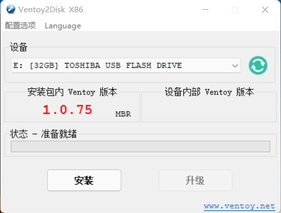
:::
:::{card} 2. 将 Ventoy 写入 USB 盘
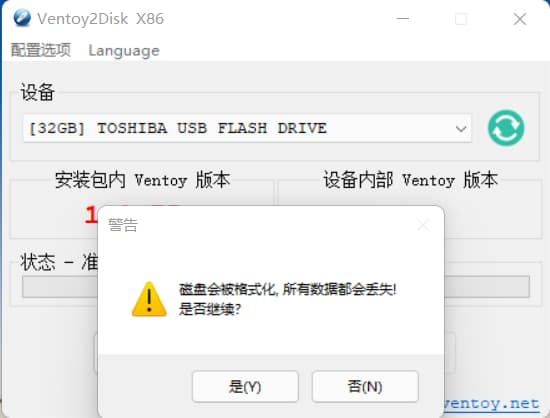
:::
:::{card} 3. USB 启动盘制作成功
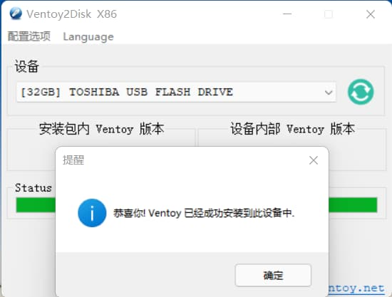
:::
:::{card} 4. 制作成功后的显示界面
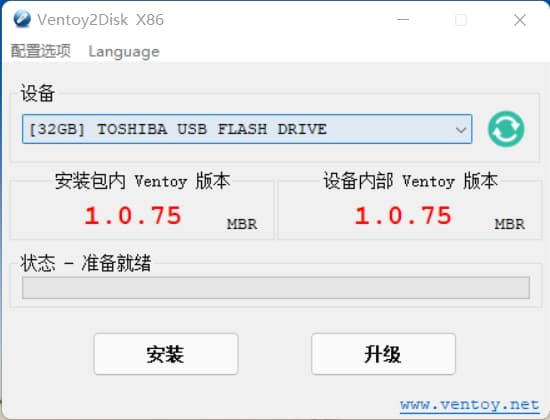
:::
:::{card} 5. 将 Linux ISO 镜像文件复制到 U 盘中
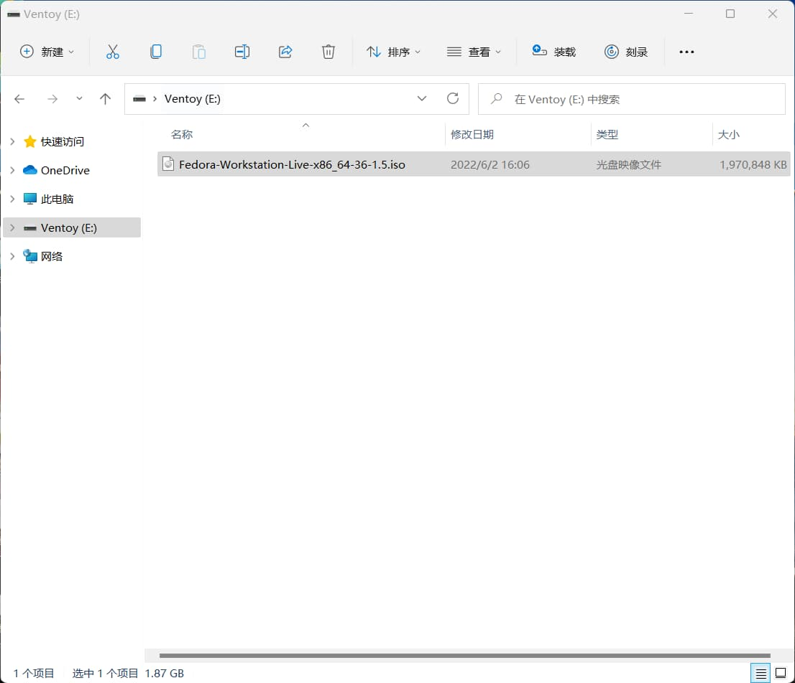
:::
::::

1. 从 [Ventoy 下载页面](https://ventoy.net/cn/download.html) 下载 Ventoy 软件包。
   解压后，执行其中的 {file}`Ventoy2Disk.exe` 程序，程序启动后界面如图 1 所示。
   Ventoy 程序自动找到了用于制作启动盘的 32 GB U 盘
2. 点击“安装”会将 Ventoy 安装到 U 盘中，此时 U 盘会被格式化。请务必确保选中的是
   目标 U 盘，且 U 盘中无其它重要文件
3. Ventoy 成功安装后，会弹出成功安装的对话框，点击确定
4. Ventoy 界面显示，安装包内 Ventoy 版本和设备内部 Ventoy 版本相同，表明 USB
   启动盘制作成功
5. 退出 Ventoy2Disk 程序。在我的电脑中找到名为 Ventoy 的 U 盘，并将已下载好的
   Linux ISO 镜像文件复制到 U 盘中即可

### 进入 Live 系统

将制作好的 USB 启动盘插入要安装 Fedora 系统的计算机上，开机启动，
按下 {kbd}`F10` 或 {kbd}`F12` 进入 BIOS，并使计算机优先从 USB 盘启动。
正确启动后，则会进入 GRUB，按向上向下键选中“Start Fedora-Workstation-Live 37”
以进入 Fedora 的 Live 系统。

:::{note}
Live 系统是指安装在 USB 启动盘中的操作系统。用户可以在 Live 系统中进行
任何操作以体验该系统。
:::

:::{tip}
1. 不同型号的电脑进入 BIOS 的方法可能不同，请自行查询。
2. 若计算机无法从 USB 盘启动，则可能是由于计算机的“安全启动”设置导致的，
   可以尝试进入 BIOS 设置，并在 BIOS 设置内关闭“安全启动”。
3. 如果尝试多次都无法正确从 USB 启动，则可能是 USB 启动盘制作失败，请尝试重新制作启动盘。
:::

### 开始安装

:::{warning}
以下安装步骤假定用户想要将 Fedora 系统作为电脑的**唯一**系统，
电脑中原有的 Windows 或其它 Linux 系统会被彻底覆盖。
如果用户想要安装双系统（即同时安装 Windows + Linux），请参考网络上的
其他文档。
:::

读者可参考下面的图解步骤和对应的说明安装操作系统（图解步骤是基于 Fedora 36 的，
但同样适用于 Fedora 37）。

::::{card-carousel} 1
:::{card} 1. 点击 “Install to Hard Drive” 以开始安装
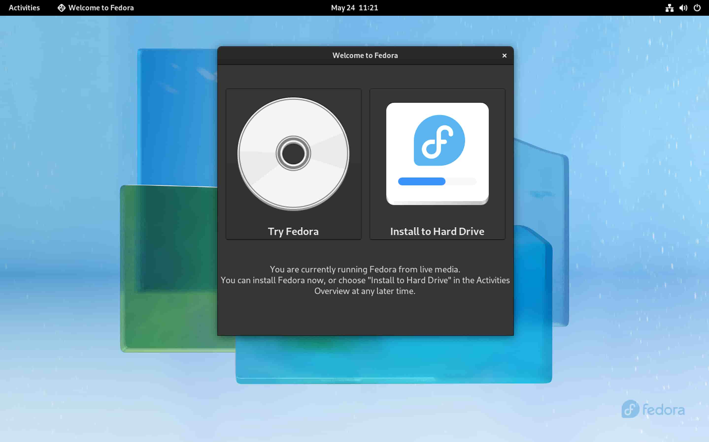
:::
:::{card} 2. 选择安装过程使用的语言
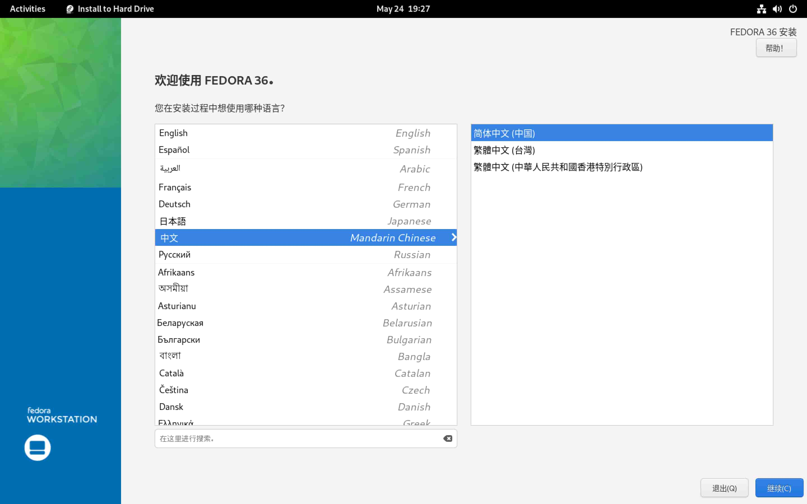
:::
:::{card} 3. 安装信息摘要界面
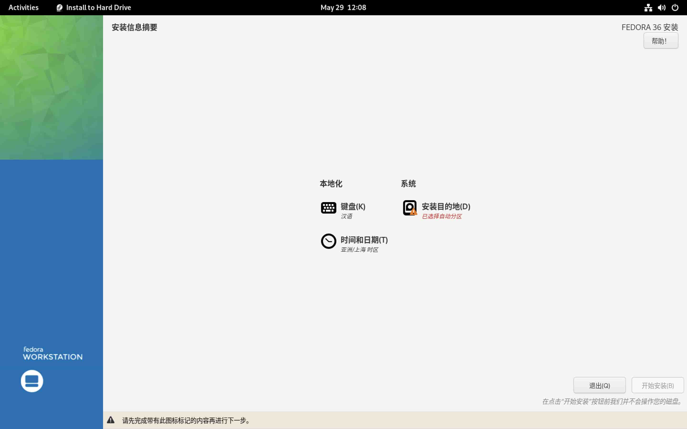
:::
:::{card} 4. 选择硬盘及分区设置
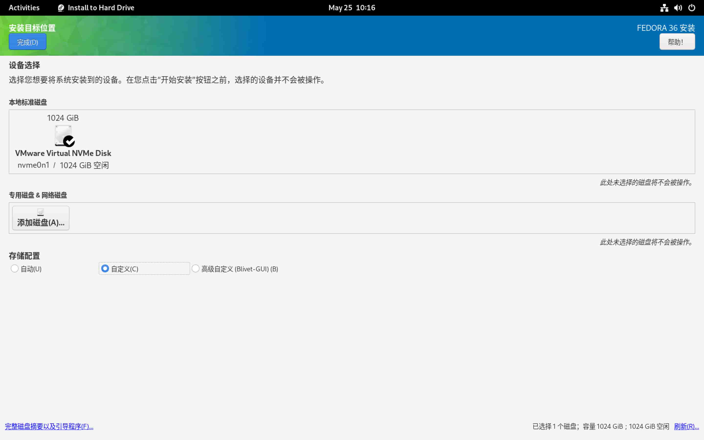
:::
:::{card} 5. 手动分区
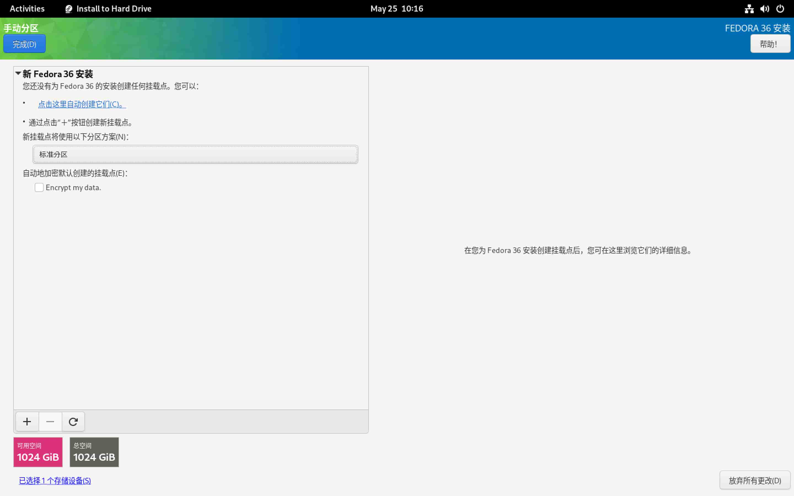
:::
:::{card} 6. 分区结果及微调
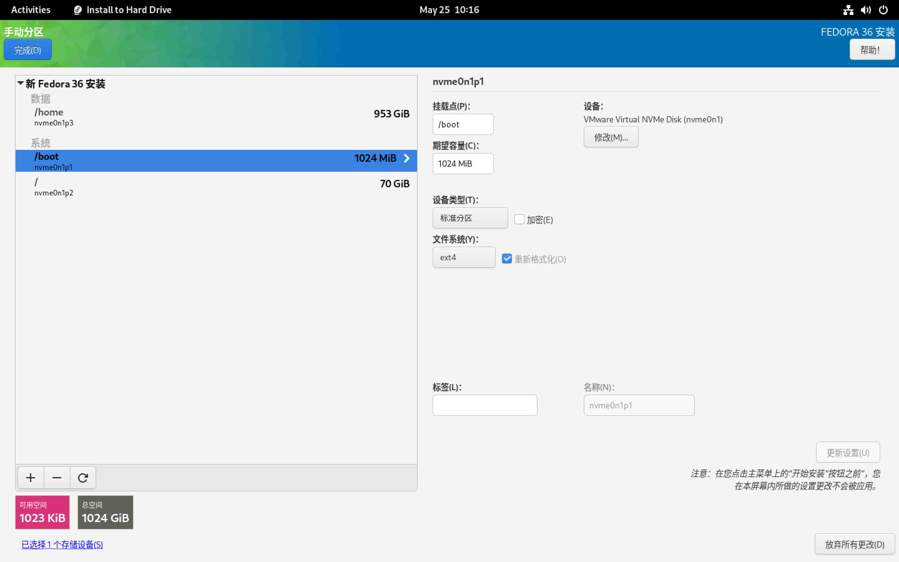
:::
:::{card} 7. 接受更改，对硬盘进行分区操作
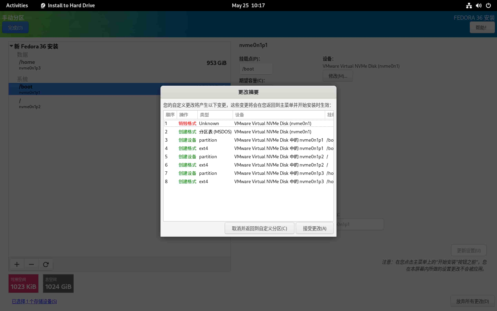
:::
:::{card} 8. 安装系统，并等待安装完成
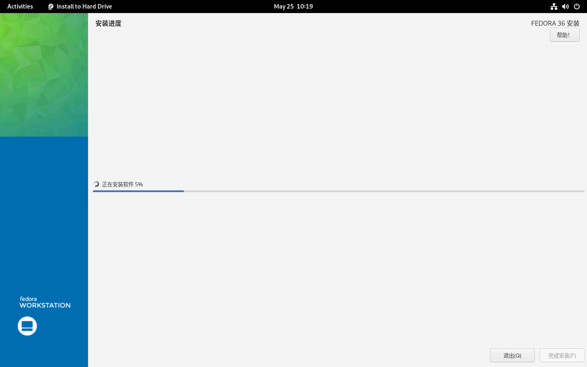
:::
:::{card} 9. 重启系统后的欢迎界面
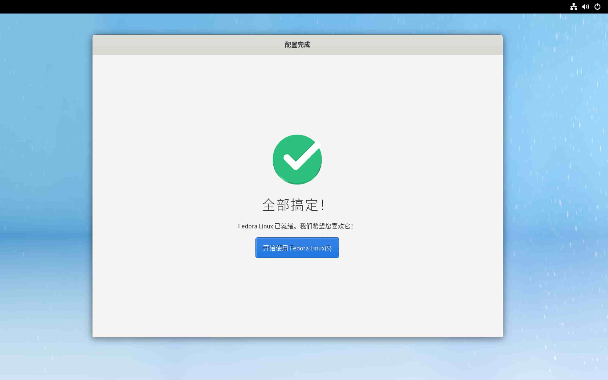
:::
:::{card} 10. 设置用户密码
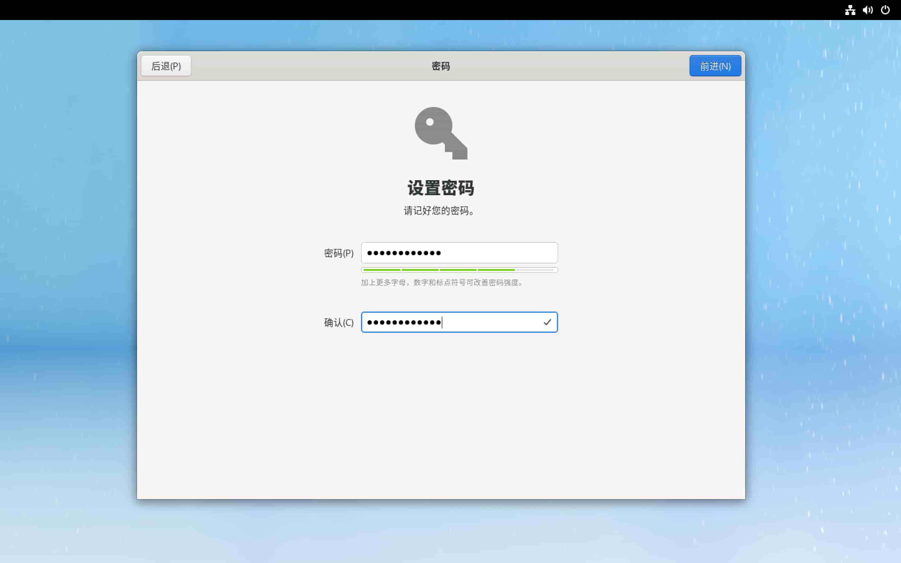
:::
:::{card} 11. 设置用户名
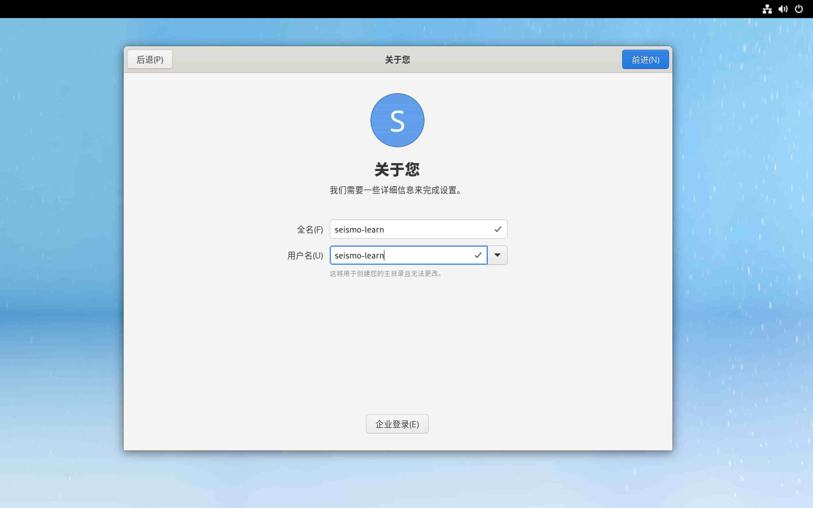
:::
:::{card} 12. 启动第三方软件源
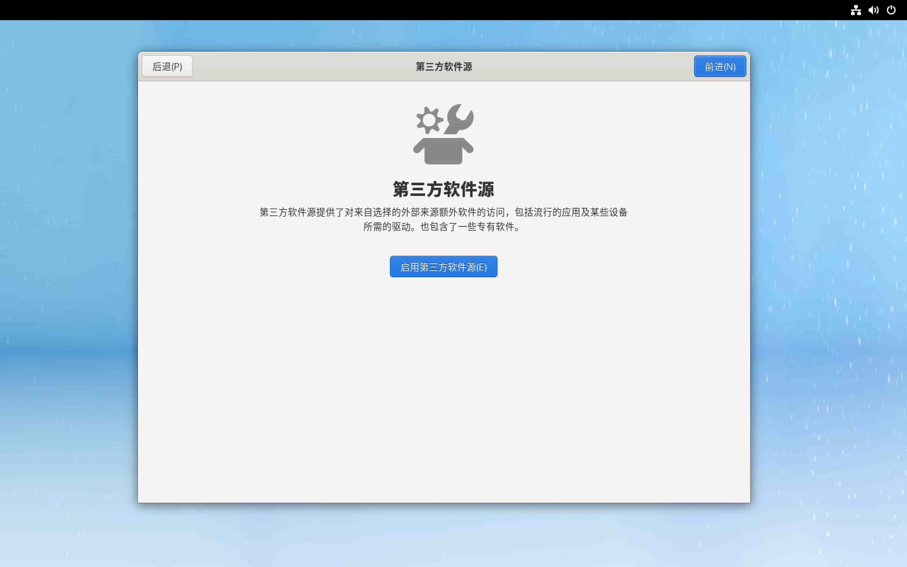
:::
:::{card} 13. 配置完成
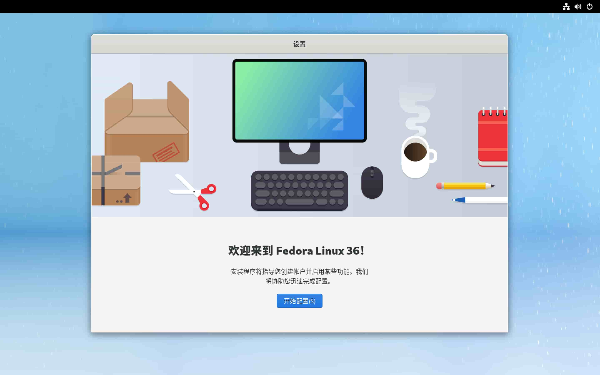
:::
::::

1. 进入 Live 系统后，选择 “Install to Hard Drive” 以启动安装程序
2. 选择安装过程中使用的语言。可以选择“中文”→“简体中文（中国）” 或
   “English”→“English (Unite States)”。选择完毕后点击下方的“继续”按钮进入下一步
3. “安装信息摘要”界面，有三个设置项，可分别设置键盘布局、日期与时间以及要
   安装系统的硬盘及分区。键盘布局、日期与时间都有默认值，一般无需修改
4. 选择“安装目的地”，进入系统硬盘和分区的设置页面。在“设备选择”中，选择要将系统
   安装到哪个硬盘。如果计算机有多个硬盘，可以将多个硬盘都选中，被选中的硬盘会有
   一个“对号”符号。需要注意，不要选中 USB 启动盘对应的 U 盘。在“存储设置”中，可以
   选择“自动”让安装程序进行自动分区，也可以选择“自定义”以人工设置分区。本教程中
   选择更灵活的“自定义”分区方式
5. 在“手动分区”页面，分区方案选择“标准分区”，然后点击“点击这里自动创建它们”，
   以自动创建分区
6. 系统一般会创建三个分区，`/` （根分区）、`/boot`（boot 分区）和 `/home`（Home 分区）。
   不了解 Linux 的用户可以直接点击“完成”按钮。有一定 Linux 基础知识且有特定
   需求的用户，可以在自动分区的基础上进一步新增分区或修改分区的硬盘大小，
   修改完成后点击“完成”按钮即可
7. 点击“完成”按钮后会弹出“分区更改摘要”对话框，点击“接受更改”则系统会对硬盘
   进行分区操作
8. 分区结束后点击“完成”按钮，则回到图 3 所示的“安装信息摘要”界面。点击“开始安装”
   按钮即进入正式安装的过程。等待安装完成，点击“完成安装”，并重启计算机。
   重启计算机时，记得拔出 USB 启动盘，以免计算机在重启后再次进入 Live 系统。

9. 重启计算机后，会看到如图 9 所示的欢迎界面
10. 设置用户密码
11. 设置账户名称。注意用户名只能是英文
12. 启用第三方软件源，以便可以直接安装更多的软件
13. 配置完成。开始使用 Fedora 系统

### 更新系统

当已安装的软件有可用的更新，或 Fedora 系统可升级至新版本时，
Fedora 会弹出提醒通知。建议用户及时更新系统及已安装的软件。

:::{warning}
更新系统前，特别是大版本更新（如 Fedora 35 更新为 Fedora 36），
最好先进行一次备份（可以参考{doc}`/best-practices/backup`）。
:::

:::{note}
本节接下来介绍的大部分软件都通过命令行安装。在桌面或菜单栏中找到并点击
“Terminal” 图标以启动终端，然后在终端中输入命令并按下 {kbd}`Enter` 键
即可执行相应的命令。
:::

## 系统软件

Fedora 系统自带了“软件中心”，可用于查找、安装、卸载和管理软件包，但一般建议使用
命令行工具 `dnf` 安装和管理软件。

:::{note}
`dnf` 会从 Fedora 软件源下载软件包。
国内用户可以参考 <http://mirrors.ustc.edu.cn/help/fedora.html> 将默认软件源镜像
替换为中科大镜像，以加快软件下载速度。

注意：在替换软件源镜像后要执行 `sudo dnf makecache` 更新本地缓存的软件包元数据。
:::

`dnf` 的详细用法请阅读 [dnf 参考文档](https://dnf.readthedocs.io/en/latest/index.html)，
这里只介绍一些常用命令:

```
# 更新本地软件包元数据缓存
$ sudo dnf makecache

# 检查并升级所有已经安装的软件
$ sudo dnf upgrade

# 检查并升级某软件
$ sudo dnf upgrade xxx

# 搜索软件
$ dnf search xxx

# 安装软件
$ sudo dnf install xxx

# 卸载软件
$ sudo dnf remove xxx
```

:::{tip}
Linux 用户也可以访问 <https://pkgs.org/> 网站查询软件包。
该网站支持多种 Linux 发行版和多个官方及第三方软件仓库，
且为每个软件包提供了丰富的元信息、依赖和被依赖关系、包含的文件、
安装方式以及更新历史等信息。
:::

## 编程开发环境

### C/C++

[GCC](https://gcc.gnu.org/) 系列的 C/C++ 编译器是 Linux 下最常用的
C/C++ 编译器，其提供了 `gcc` 和 `g++` 命令:

```
$ sudo dnf install gcc gcc-c++
```

### Fortran

[GNU Fortran](https://gcc.gnu.org/fortran/) 编译器是 Linux 下最常用的
Fortran 编译器，其提供了 `gfortran` 命令:

```
$ sudo dnf install gcc-gfortran
```

### Java

运行 Java 程序需要安装 Java 运行环境，即 OpenJDK:

```
$ sudo dnf install java-11-openjdk
```

### git

[git](https://git-scm.com/) 是目前最流行的版本控制工具，推荐在科研过程中
使用 git 管理自己编写的代码和文件。一般情况下系统已经安装了该软件。如果没安装，
可以使用如下命令安装:

```
$ sudo dnf install git
```
