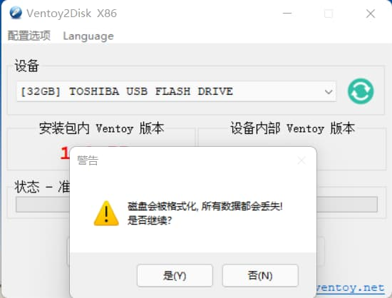
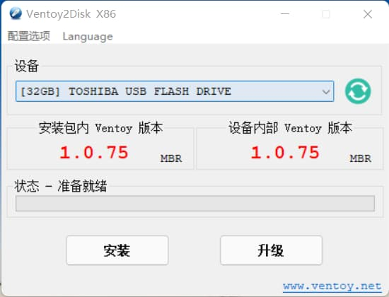

# Ubuntu 配置指南

- 本节贡献者: {{田冬冬}}（作者）、{{姚家园}}（审稿）
- 最近更新日期: 2022-05-29
- 预计花费时间: 120 分钟

---

:::{note}
本节内容适用于 **Ubuntu Desktop 22.04 LTS**，不一定适用于其他 Ubuntu 版本。
建议用户总是选择 Ubuntu 最新的长期支持版（目前是 Ubuntu 22.04 LTS）或最新版本
（目前是 Ubuntu 22.10），也欢迎用户帮助我们更新本文以适配 Ubuntu 最新版本。
:::

## 安装系统

### 下载系统镜像

访问 [Ubuntu 官网](https://ubuntu.com/) 并下载 Ubuntu Desktop 镜像文件，
一般选择 AMD64（x86_64）版本。

**Ubuntu Desktop 22.04 LTS AMD64** 的 ISO 镜像文件（约 2.9 GB）下载链接：

- [官方镜像](https://releases.ubuntu.com/22.04/ubuntu-22.04.1-desktop-amd64.iso)
- [中科大镜像](https://mirrors.ustc.edu.cn/ubuntu-releases/22.04/ubuntu-22.04.1-desktop-amd64.iso)[**推荐国内用户使用**]

### 制作 USB 启动盘

:::{warning}
制作 USB 启动盘时会格式化 U 盘！请确保 U 盘中无重要文件！
:::

准备一个 4 GB 以上容量的 U 盘，并使用 [Ventoy](https://ventoy.net/cn/) 制作 USB 启动盘。
Ventoy 可以在 Windows 和 Linux 下使用，详细用法见 [官方文档](https://ventoy.net/cn/doc_start.html)。
下面以图解形式演示如何在 Windows 下使用 Ventoy 制作 USB 启动盘。

::::{card-carousel} 1
:::{card} 1. 启动 Ventoy2Disk.exe 程序

:::
:::{card} 2. 将 Ventoy 写入 USB 盘

:::
:::{card} 3. USB 启动盘制作成功

:::
:::{card} 4. 制作成功后的显示界面

:::
:::{card} 5. 将 Linux ISO 镜像文件复制到 U 盘中

:::
::::

1. 从 [Ventoy 下载页面](https://ventoy.net/cn/download.html) 下载 Ventoy 软件包。
   解压后，执行其中的 {file}`Ventoy2Disk.exe` 程序，程序启动后界面如图 1 所示。
   Ventoy 程序自动找到了用于制作启动盘的 32 GB U 盘
2. 点击“安装”会将 Ventoy 安装到 U 盘中，此时 U 盘会被格式化。请务必确保选中的是
   目标 U 盘，且 U 盘中无其它重要文件
3. Ventoy 成功安装后，会弹出成功安装的对话框，点击确定
4. Ventoy 界面显示，安装包内 Ventoy 版本和设备内部 Ventoy 版本相同，表明 USB
   启动盘制作成功
5. 退出 Ventoy2Disk 程序。在我的电脑中找到名为 Ventoy 的 U 盘，并将已下载好的
   Linux ISO 镜像文件复制到 U 盘中即可

### 进入 Live 系统

将制作好的 USB 启动盘插入要安装 Ubuntu 系统的计算机上，开机启动，
按下 {kbd}`F10` 或 {kbd}`F12` 进入 BIOS，并使计算机优先从 USB 盘启动。
正确启动后，则会进入 GRUB，按向上向下键选中“Ubuntu”以进入 Ubuntu 的 Live 系统。

:::{note}
Live 系统是指安装在 USB 启动盘中的操作系统。用户可以在 Live 系统中进行
任何操作以体验该系统。
:::

:::{tip}
1. 不同型号的电脑进入 BIOS 的方法可能不同，请自行查询。
2. 若计算机无法从 USB 盘启动，则可能是由于计算机的“安全启动”设置导致的，
   可以尝试进入 BIOS 设置，并在 BIOS 设置内关闭“安全启动”。
3. 如果尝试多次都无法正确从 USB 启动，则可能是 USB 启动盘制作失败，请尝试重新制作启动盘。
:::

### 开始安装

:::{warning}
以下安装步骤假定用户想要将 Ubuntu 系统作为电脑的**唯一**系统，
电脑中原有的 Windows 或其它 Linux 系统会被彻底覆盖。
如果用户想要安装双系统（即同时安装 Windows + Linux），请参考网络上的
其他文档。
:::

读者可参考下面的图解步骤和对应的说明安装操作系统。

::::{card-carousel} 1
:::{card} 1. 欢迎界面

:::
:::{card} 2. 选择安装过程中使用的语言

:::
:::{card} 3. 设置键盘布局

:::
:::{card} 4. 设置要安装的软件

:::
:::{card} 5. 设置安装类型

:::
:::{card} 6. 对硬盘进行分区操作

:::
:::{card} 7. 设置时区

:::
:::{card} 8. 设置用户名与密码

:::
:::{card} 9. 等待安装完成

:::
::::

1. 进入欢迎界面，左侧可以选择安装过程中使用的语言
2. 选择“中文（简体）”，点击“安装 Ubuntu”即开始安装
3. 选择键盘布局，汉语或 “English(US)”均可
4. 选择“正常安装”，建议勾选“安装 Ubuntu 时下载更新”和“为图形或无线硬件，
   以及其他媒体格式安装第三方软件”
5. 在“安装类型”界面，选择“清除整个硬盘并安装 Ubuntu”，安装程序会进行自动分区。
   有经验的用户也可以选择“其他选项”自定义分区，但需要了解 Linux 的分区操作。
   对于一般用户而言，建议使用默认的自动分区
6. 单击“现在安装”，选择“继续”以将改动写入磁盘
7. 选择时区（例如“上海”）
8. 输入账户信息和密码信息。注意用户名只能是英文
9. 等待安装完成。完成后点击“现在重启”以重启计算机。

重启计算机时，记得拔出 USB 启动盘，以免再次进入 USB 安装镜像。

### 更新系统

当已安装的软件有可用的更新，或 Ubuntu 系统可升级至新版本时，
Ubuntu 会弹出提醒通知。建议用户及时更新系统及安装的软件。

:::{warning}
更新系统前，特别是大版本更新（如 Ubuntu 20.04 更新为 Ubuntu 20.10），
最好先进行一次备份（可以参考{doc}`/best-practices/backup`）。
:::

:::{note}
本节接下来介绍的大部分软件都通过命令行安装。在桌面或菜单栏中找到并点击
“Terminal” 图标以启动终端，然后在终端中输入命令并按下 {kbd}`Enter` 键
即可执行相应的命令。
:::

## 系统软件

Ubuntu 系统自带了“软件中心”，可用于查找、安装、卸载和管理软件包，但一般建议使用
命令行工具 `apt` 安装和管理软件。

:::{note}
`apt` 会从 Ubuntu 软件源下载软件包。
国内用户可以参考 <https://mirrors.ustc.edu.cn/help/ubuntu.html> 将默认软件源镜像
替换为中科大镜像，以加快软件下载速度。

注意：在替换软件源镜像后要执行 `sudo apt update` 更新本地缓存的软件包元数据。
:::

`apt` 的详细用法请阅读 [apt 帮助文档](http://manpages.ubuntu.com/manpages/focal/man8/apt.8.html)，
这里只介绍一些常用命令:

```
# 更新本地软件包元数据
$ sudo apt update

# 检查并升级所有已经安装的软件
$ sudo apt upgrade

# 搜索软件
$ apt search xxx

# 安装或升级软件
$ sudo apt install xxx

# 检查并升级某软件
$ sudo apt --only-upgrade install xxx

# 卸载软件
$ sudo apt remove xxx  （保留配置文件）
$ sudo apt purge xxx  （删除配置文件）
```

:::{tip}
Linux 用户也可以访问 <https://pkgs.org/> 网站查询软件包。
该网站支持多种 Linux 发行版和多个官方及第三方软件仓库，
且为每个软件包提供了丰富的元信息、依赖和被依赖关系、包含的文件、
安装方式以及更新历史等信息。
:::

## 编程开发环境

### C/C++

[GCC](https://gcc.gnu.org/) 系列的 C/C++ 编译器是 Linux 下最常用的
C/C++ 编译器，其提供了 `gcc` 和 `g++` 命令:

```
$ sudo apt install gcc g++
```

### Fortran

[GNU Fortran](https://gcc.gnu.org/fortran/) 编译器是 Linux 下最常用的
Fortran 编译器，其提供了 `gfortran` 命令:

```
$ sudo apt install gfortran
```

### Java

运行 Java 程序需要安装 Java 运行环境，即 OpenJDK:

```
$ sudo apt install default-jdk
```

### git

[git](https://git-scm.com/) 是目前最流行的版本控制工具，推荐在科研过程中
使用 git 管理自己编写的代码和文件。一般情况下系统已经安装了该软件。如果没安装，
可以使用如下命令安装:

```
$ sudo apt install git
```
