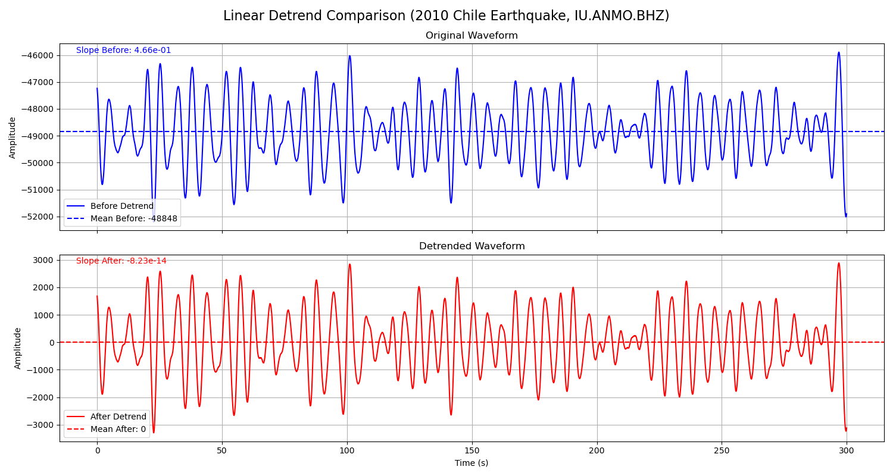

---
jupytext:
  text_representation:
    extension: .md
    format_name: myst
    format_version: 0.13
    jupytext_version: 1.13.0
kernelspec:
  display_name: Python 3
  language: python
  name: python3
---

# 去线性趋势

- 本节贡献者: {{何星辰}}（作者）
- 最近更新日期: 2025-09-07
- 预计花费时间: 10 分钟

去线性趋势是指计算能够最佳拟合整个波形数据的一条直线（即趋势线），并从每个数据点中减去该直线对应的值，使波形在一个水平的零基线附近振动。这一操作旨在消除更复杂的长周期趋势，例如由仪器温度变化引起的缓慢漂移，或是大地震后地表永久变形导致的基线跳变。它为后续的傅里叶变换、滤波或积分奠定关键基础，避免因原始趋势导致频谱中出现虚假的低频能量以及积分结果的严重发散。


在此我们同样使用上一节中的2010年智利地震波形数据，其原始波形显示显著线性漂移（斜率0.466），反映出仪器基线偏移。


然后，我们通过ObsPy的`detrend("linear")`方法拟合并移除线性趋势，后处理后斜率降至-8.23e-14，同时均值精确为0，成功校正基线而不改变地震信号形态。


```{code-cell} ipython3
import obspy
from obspy.clients.fdsn import Client
import matplotlib.pyplot as plt
import numpy as np

client = Client("IRIS")

## （2010年智利地震的数据）
starttime = obspy.UTCDateTime("2010-02-27T06:30:00")
endtime = starttime + 300  


st = client.get_waveforms(
    network="IU",
    station="ANMO", 
    location="00", 
    channel="BHZ",
    starttime=starttime, 
    endtime=endtime)
    
tr = st[0]
tr_original = tr.copy()


## 执行线性去趋势
tr.detrend("linear")
time_array = tr_original.times()
# 计算处理前后的斜率和均值
p_before = np.polyfit(time_array, tr_original.data, 1)
mean_before = np.mean(tr_original.data)
p_after = np.polyfit(time_array, tr.data, 1)
mean_after = np.mean(tr.data)

## 处理前后绘图对比
fig, axes = plt.subplots(nrows=2, ncols=1, figsize=(15, 8), sharex=True)
fig.suptitle('Linear Detrend Comparison (2010 Chile Earthquake, IU.ANMO.BHZ)', fontsize=16)

# (处理前)
ax1 = axes[0]
ax1.plot(tr_original.times(), tr_original.data, color='black', label='Before Detrend')
ax1.axhline(y=mean_before, color='black', linestyle='--', label=f'Mean Before: {mean_before:.0f}')
ax1.text(0.02, 0.95, f'Slope Before: {p_before[0]:.2e}', transform=ax1.transAxes, color='black')
ax1.set_title('Original Waveform')
ax1.set_ylabel('Amplitude')
ax1.legend(loc='lower left')
ax1.grid(True)

#  (处理后)
ax2 = axes[1]
ax2.plot(tr.times(), tr.data, color='black', label='After Detrend')
ax2.axhline(y=mean_after, color='black', linestyle='--', label=f'Mean After: {mean_after:.0f}')
ax2.text(0.02, 0.95, f'Slope After: {p_after[0]:.2e}', transform=ax2.transAxes, color='black')
ax2.set_title('Detrended Waveform')
ax2.set_xlabel('Time (s)')
ax2.set_ylabel('Amplitude')
ax2.legend(loc='lower left')
ax2.grid(True)

plt.tight_layout() 
plt.savefig("detrend.png")
plt.show()

```




