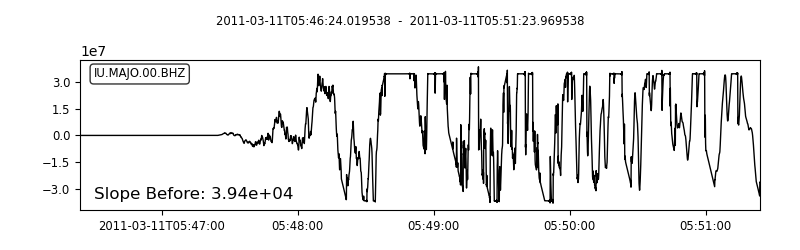
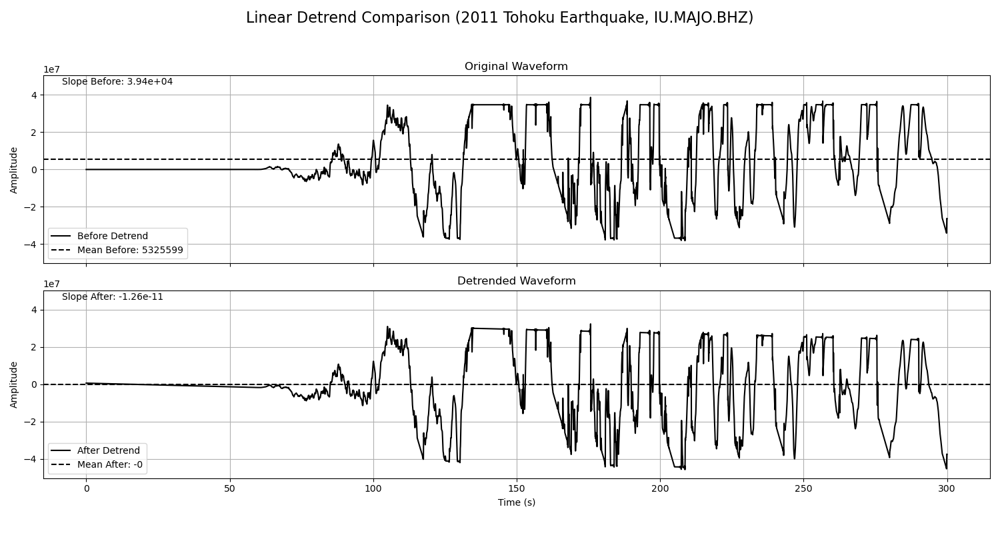

# 去线性趋势

- 本节贡献者: {{何星辰}}（作者）
- 最近更新日期: 2025-09-07
- 预计花费时间: 10 分钟

去线性趋势是指计算能够最佳拟合整个波形数据的一条直线（即趋势线），并从每个数据点中减去该直线对应的值，使波形在一个水平的零基线附近振动。这一操作旨在消除更复杂的长周期趋势，例如由仪器温度变化引起的缓慢漂移，或是大地震后地表永久变形导致的基线跳变。它为后续的傅里叶变换、滤波或积分奠定关键基础，避免因原始趋势导致频谱中出现虚假的低频能量以及积分结果的严重发散。


首先，我们下载2011年东日本大地震（M9.0）中位于IU网络MAJO台站的BHZ通道5分钟波形数据，其原始波形显示显著线性漂移（斜率3.94e+04，均值-53259），反映出仪器基线偏移。

```{code-cell} ipython3
import obspy
from obspy.clients.fdsn import Client
import matplotlib.pyplot as plt
import numpy as np

client = Client("IRIS")

# 下载数据
starttime = obspy.UTCDateTime("2011-03-11T05:46:24")
endtime = starttime + 5 * 60
st = client.get_waveforms(
    network="IU",
    station="MAJO",
    location="00",
    channel="BHZ",
    starttime=starttime,
    endtime=endtime
)

tr = st[0]

# 计算原始数据的斜率
time_array = tr.times()
p_before = np.polyfit(time_array, tr.data, 1)
fig = st.plot(show=False)

# 在图上添加斜率信息
ax = fig.axes[0]
ax.text(0.02, 0.05, f'Slope Before: {p_before[0]:.2e}', 
        transform=ax.transAxes, 
        color='k',
        fontsize=12,
        verticalalignment='bottom') 

# 保存图像
fig.savefig("detrend-1.png")
plt.show()
```





然后，我们通过ObsPy的`detrend("linear")`方法拟合并移除线性趋势，后处理后斜率降至-1.26e-11，均值精确为0，成功校正基线而不改变地震信号形态。


```{code-cell} ipython3

tr = st[0]
tr_original = tr.copy()
# 线性去趋势
tr.detrend("linear")
time_array = tr_original.times()

# 计算处理前后的斜率和均值
p_before = np.polyfit(time_array, tr_original.data, 1)
mean_before = np.mean(tr_original.data)
p_after = np.polyfit(time_array, tr.data, 1)
mean_after = np.mean(tr.data)

#绘图对比
fig, axes = plt.subplots(nrows=2, ncols=1, figsize=(15, 8), sharex=True)
fig.suptitle('Linear Detrend Comparison (2011 Tohoku Earthquake, IU.MAJO.BHZ)', fontsize=16)

# 统一Y轴范围
y_max = max(np.max(np.abs(tr_original.data)), np.max(np.abs(tr.data))) * 1.1
y_range = [-y_max, y_max]
ax1 = axes[0]
ax1.plot(tr_original.times(), tr_original.data, color='black', label='Before Detrend')
ax1.axhline(y=mean_before, color='black', linestyle='--', label=f'Mean Before: {mean_before:.0f}')
ax1.text(0.02, 0.95, f'Slope Before: {p_before[0]:.2e}', transform=ax1.transAxes, color='black')
ax1.set_title('Original Waveform')
ax1.set_ylabel('Amplitude')
ax1.set_ylim(y_range)
ax1.legend(loc='lower left')
ax1.grid(True)


ax2 = axes[1]
ax2.plot(tr.times(), tr.data, color='black', label='After Detrend')
ax2.axhline(y=mean_after, color='black', linestyle='--', label=f'Mean After: {mean_after:.0f}')
ax2.text(0.02, 0.95, f'Slope After: {p_after[0]:.2e}', transform=ax2.transAxes, color='black')
ax2.set_title('Detrended Waveform')
ax2.set_xlabel('Time (s)')
ax2.set_ylabel('Amplitude')
ax2.set_ylim(y_range)
ax2.legend(loc='lower left')
ax2.grid(True)

plt.tight_layout(rect=[0, 0.03, 1, 0.95]) 
plt.savefig("detrend-2.png")
plt.show()

```




