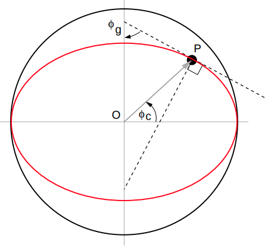

距离和角度
==========

知道地震和台站地理坐标后，经常要计算震中距、方位角、反方位角以及入射角，
这是地震学的一个基本问题。

震中距
------

地震、球面上任意一点和球心所在的球面圆形称为大圆（*great circle*）。
大圆由从震中到这一点的小圆弧（*minor arc*）和大圆弧（*major arc*）
两部分组成。

震中距指震中到地面上任意一点的球面距离，即小圆弧或大圆弧的长度，单位一般
为度或公里等。除非显示申明，一般默认是小圆弧长度。

方位角和反方位角
----------------

方位角是震中到台站的连线与地理北向的夹角，而反方位角指台站到震中的连线与地理北向的夹角。

.. figure:: az_baz.png
   :alt: 震中距、方位角、反方位角示意图
   :width: 50.0%
   :align: center

   震中距、方位角、反方位角示意图

出射角和入射角
--------------

射线从震源出射时，与垂直方向的角度。例如，从震源正下方出射的射线的出射角为 0°。

射线入射到台站时，与垂直方向的角度。例如，从台站正下方入射的射线的入射角为 0°。

.. note::

   不同软件对出射角和入射角的定义可能会有区别。例如，``taup_time`` 定义出射角为
   射线从震源出射时与\ **垂直向下**\ 方向的夹角，而入射角为射线入射到台站时
   与\ **垂直向上**\ 方向的夹角。

计算
-----

计算震中距、方位角和反方位角的公式的推导需要简单的球面三角函数的知识。
具体的推导可以参考 Robert B. Herrmann 的
`作业题 <http://www.eas.slu.edu/People/RBHerrmann/Courses/EASA462>`__\ 。
作业题中的 Ass06、Ass07、Ass08 给出了计算震中距和方位角的原理。

这里简单介绍基本的计算步骤。地震和台站的经纬度一般用的地理坐标系，而地震学
一般用的是地心坐标系。如果地球是完美球体，二者是等价的。但是，我们一般用
参考椭球体近似地球，这时二者就有区别了。

首先，我们将地理坐标系下的纬度转换成地心坐标系下的纬度。然后在地心坐标系下
计算震中距、方位角以及反方位角。这时计算得到的震中距的单位是公里或米等长度单位，若
需转成弧度，可以假设地球是一个完美球体（如半径为 6371 km）。

   
   地心和地理坐标系的纬度

可以使用广为流传的 ``distaz`` 程序来计算震中距、方位角和反方位角，也可以使用ObsPy 的
`gps2dist_azimuth <https://docs.obspy.org/packages/autogen/obspy.geodetics.base.gps2dist_azimuth.html#obspy.geodetics.base.gps2dist_azimuth>`__
函数和 `kilometers2degrees <https://docs.obspy.org/packages/autogen/obspy.geodetics.base.kilometers2degrees.html#obspy.geodetics.base.kilometers2degrees>`__
函数计算。

可以使用 ``taup_time`` 计算出射角和入射角。
