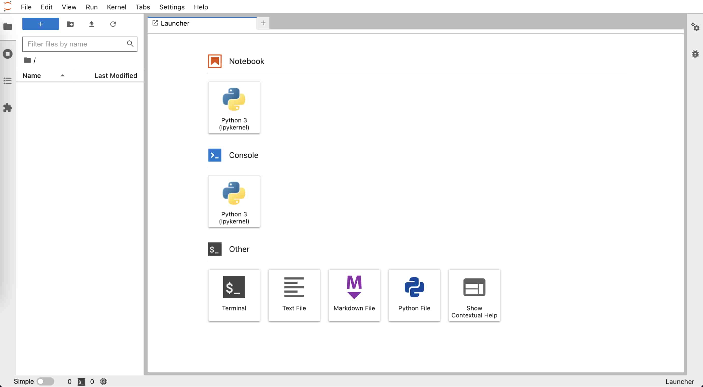

# Python 语言

- 本节贡献者: {{田冬冬}}（作者）、{{姚家园}}（审稿）
- 最近更新日期: 2022-06-24
- 预计花费时间: 60 分钟

---

## 简介

[Python](https://www.python.org/) 是一种广泛使用的通用编程语言，其具有语法简单、
功能强大等优点，是目前地震学科研最常用的编程语言之一。

这一节中，我们不介绍具体的 Python 语法，而是着重介绍如何安装和管理 Python、
如何编写并执行 Python 脚本等。这一节的最后列出了一些免费的 Python 学习资源，
读者可根据需要自行学习。

## 安装 Miniconda

Python 是一种解释型语言，需要专门的解释器去执行 Python 代码。
尽管 Linux/macOS 系统内置了 Python 解释器，但是建议用户不要使用它，
以免误操作破坏系统内置 Python， 造成系统出现问题。
**建议用户安装 Miniconda， 使用其提供的 `conda` 命令管理和安装 Python 及其模块。**

:::{dropdown} Python、Anaconda 和 Miniconda 的区别与联系
:color: info
:icon: info

在安装和使用 Miniconda 前，读者有必要了解 Python、Anaconda 和 Miniconda 三者
之间的区别与联系：

Python 解释器
: 从 [Python 官方网站](https://www.python.org/downloads/) 下载的 Python 安装包
  只提供了一个 Python 解释器，仅包含 Python 的核心模块和库，是运行 Python
  脚本所必需的。使用官方的 Python 安装包相当于安装了 Python 解释器 + 核心模块/库。

Anaconda
: [Anaconda](https://www.anaconda.com/) 是一个 Python **发行版**，不仅提供了
  Python 解释器，还内置了很多 Python 开发工具与众多科学计算相关的库，形成了
  一个可以开箱即用的 Python 科学计算环境，省去了自行配置科学计算环境的麻烦。
  Anaconda 还提供了强大的软件包管理工具 `conda`，可以方便地安装模块和管理环境。
  安装 Anaconda 相当于安装了 Python 解释器 + 核心模块/库 + 数百个科学计算相关模块 + 包管理器 `conda`。

  尽管 Anaconda 有很多优点，其也有明显的缺点：
  - 安装包非常大（超过 500 MB）
  - 安装过程耗时长（一般超过 5 分钟）
  - 安装后占用大量硬盘空间（一般超过 3 GB）
  - 安装了很多平时用不到的模块，进而导致安装新模块时会可能出现版本冲突

Miniconda
: [Miniconda](https://docs.conda.io/en/latest/miniconda.html) 是 Anaconda 的精简版。
  它继承了 Anaconda 的优点，同时避免了 Anaconda 的臃肿。其安装包只有约 50 MB，安装
  通常也只需要数十秒。安装 Miniconda 相当于安装了 Python 解释器 + 核心模块/库 + 包管理器 `conda`。
:::

下面展示了如何在 Linux 系统下安装 Miniconda。其它操作系统下的安装说明以及具体使用方法可以参考
{doc}`地震“学”软件中 Anaconda 相关内容 <software:anaconda/index>`。

1. 下载 Miniconda

   下载地址：[Miniconda3-latest-Linux-x86_64.sh](https://mirrors.tuna.tsinghua.edu.cn/anaconda/miniconda/Miniconda3-latest-Linux-x86_64.sh)

2. 安装 Miniconda

   ```
   $ bash Miniconda3-latest-Linux-x86_64.sh
   ```

   Miniconda 默认会安装到 {file}`${HOME}/miniconda3` 下，在安装过程中可以
   设置为其他路径。

   安装通常只需要十几秒，在安装的最后会出现：

        Do you wish the installer to initialize Miniconda3
        by running conda init? [yes|no]
        [no] >>>

   输入 `yes` 则安装包会向当前 SHELL 的配置文件写入 `conda` 初始化语句。

3. 测试安装

   打开一个新的终端，在终端中输入 `python`，输出中看到 **Anaconda, Inc.**
   字样即代表成功安装 Miniconda 并启动了 Python 解释器：

        $ python
        Python 3.9.12 (main, Apr  5 2022, 01:53:17)
        [GCC 7.5.0] :: Anaconda, Inc. on linux
        Type "help", "copyright", "credits" or "license" for more information.
        >>>

   在提示符 `>>>` 后输入 `quit()` 后按下 {kbd}`Enter` 键退出 Python 解释器。

## 初识 Python

打开终端，输入 `python` 就会进入 Python 解释器的交互模式：

```
$ python
Python 3.9.12 (main, Apr  5 2022, 01:53:17)
[GCC 7.5.0] :: Anaconda, Inc. on linux
Type "help", "copyright", "credits" or "license" for more information.
>>>
```

进入 Python 解释器后，首先会显示 Python 版本信息、版权声明以及帮助信息，
然后会显示符号 `>>>`。`>>>` 是 Python 解释器在交互模式下的主提示符，提示用户
可以在 `>>>` 后输入 Python 指令。

在 `>>>` 提示符后输入 `1 + 2` 并按下 {kbd}`Enter` 键将指令 `1 + 2` 传给 Python
解释器。解释器接收指令后会执行指令，输出结果 `3`，并再次显示主提示符
`>>>` 等待用户的下一次输入。
```python
>>> 1 + 2
3
>>>
```
:::{tip}
Python 解释器交互模式可以当做一个快捷的计算器来使用！
:::

下面继续看一个稍复杂点的例子。给变量 `x` 赋值，然后紧跟着一个判断语句
“如果 x 的值大于 0，则打印字符串 Hello world!”。
```python
>>> x = 5
>>> if x > 0:
...     print("Hello world!")
...
Hello world!
>>>
```
这个判断语句无法在一行写完，因而需要写成多行语句。
在主提示符后输入 `if x > 0:` 并按下 {kbd}`Enter` 键，会显示符号 `...`。
`...` 是 Python 解释器在交互模式下的次提示符，用于表明多行语句还没写完，需要继续输入。
在次提示符 `...` 后不输入指令而直接键入 {kbd}`Enter`，表示该代码块已结束。
Python 解释器会对输入的多行语句进行解释，并输出字符串“Hello world!”。
:::{note}
C 语言使用大括号 `{ }` 划分代码块，而 Python 中使用缩进划分代码块！
因而上面的例子中 `print` 前需要用空格缩进（通常是 4 个空格）。
:::

在主提示符 `>>>` 后输入 `quit()` 或者按下 {kbd}`Ctrl` + {kbd}`D` 键
即可退出 Python 解释器的交互模式。
```python
>>> quit()
```

## Python 脚本

虽然在 Python 解释器的交互模式下可以执行 Python 代码，但写长代码非常不方便，
其代码编辑功能很弱，也不具备代码补全功能。更重要的是，退出交互模式后，
之前写的 Python 代码不会保存，下次想要执行相同代码时只能重写。
因而，通常都不会在 Python 解释器的交互模式下写代码，而是将 Python 代码写到 Python 脚本中。

Python 脚本其实就是一个包含了一系列 Python 指令的文本文件，后缀通常是 `.py`，
在终端中可以通过 `python xxxx.py` 的方式执行 Python 脚本（`xxxx.py` 是 Python
脚本的文件名）。

下面以一个简单的 Python 脚本作为示例。启动文本编辑器，新建一个文件，将以下
Python 代码写到文件中：
```python
x = 5
if x > 0:
    print("Hello world!")
```
将文件保存为后缀 `.py` 的文件（比如 {file}`first-script.py`），即得到了
一个可执行的 Python 脚本。打开终端，切换到 Python 脚本所在的目录，执行如下命令来运行脚本：
```
$ python first-script.py
Hello world!
```

## 安装 Python 包

Python 语言的一大特色是其功能强大的标准库和第三方软件包（也称模块或库）。
Python 解释器内置了所有标准库，安装解释器后就可以直接使用标准库，
而第三方包需要先安装才能使用。

:::{admonition} `pip`、`conda` 与 `mamba`

学习如何安装 Python 包之前，有必要先了解 `pip`、`conda` 和 `mamba`，以及它们之间的
区别与联系:

[`pip`](https://pip.pypa.io/)
: `pip` 是 Python 官方提供的包管理器，可以安装 [Python 包索引网站](https://pypi.org/) 上的
  Python 包，也可用于从源码安装 Python 包。

[`conda`](https://docs.conda.io/)
: `conda` 是 Anaconda/Miniconda 提供的包管理器，不仅可以安装 Python 包，
  还可以安装其他语言写的包（理论上可以安装任何软件）。它的另一个重要功能是管理 Python 环境，
  可用于在一个系统内安装多个不同版本的 Python 解释器或包。

  `conda` 功能强大，但其最大的缺点就是**慢**。安装软件包前解析软件包之间的版本
  依赖关系很慢，下载和安装也很慢。

[`mamba`](https://mamba.readthedocs.org/)
: `mamba` 是 `conda` 的替代品，不仅解析软件的版本依赖关系非常快（其核心代码是用 C 语言编写的），
  还可以并行下载、安装软件包，大大减少了安装软件的时间。
  `mamba` 的用法与 `conda` 几乎完全一致，网络上看到的 `conda` 命令，将 `conda`
  替换为 `mamba` 即可直接执行。
:::

**推荐使用包管理器 [`mamba`](https://mamba.readthedocs.org/) 安装和管理 Python 包。**

`mamba` 使用的是 `conda` 的配置文件，因而使用 `mamba` 前，需先对 `conda` 做简单配置：
```
# 增加 conda-forge 通道，可以安装更多的软件包
$ conda config --add channels conda-forge
# 显示通道的 URL
$ conda config --set show_channel_urls true
# 配置使用国内清华源以加快软件下载速度
$ conda config --add default_channels https://mirrors.tuna.tsinghua.edu.cn/anaconda/pkgs/main
$ conda config --set 'custom_channels.conda-forge' https://mirrors.tuna.tsinghua.edu.cn/anaconda/cloud
```

使用 `conda` 安装 `mamba`：
```
$ conda install 'mamba>=0.16'
```

安装 `mamba` 后，执行如下命令即可在 bash 中使用 `mamba` 的所有功能：
```
$ mamba init bash
```
至此，就可以完全使用 `mamba` 管理和安装 Python 包和环境了。

使用 `mamba` 安装软件很简单，直接 `mamba install` 加上要安装的软件包名称即可。
`mamba` 可安装的软件包位于 [Anaconda 网站](https://anaconda.org/)。

读者可以执行如下命令，安装本节余下内容会用到的几个 Python 包：
```
$ mamba install numpy matplotlib jupyterlab
```

对于 [Anaconda 网站](https://anaconda.org/) 没有的包，则只能使用 `pip` 安装。

## Jupyter Notebook

前面介绍了如何在 Python 解释器交互模式执行 Python 代码，也介绍了如何将 Python
代码写成脚本并执行。这两种方式各有优缺点：交互模式下编写代码不方便，
但是可以一句一句执行代码，随时检查某个语句的输出或某个变量的值。
编写 Python 脚本可以在编辑器中完成，因而写代码更加高效，但执行 Python 脚本时
只能从头到尾执行，每次修改代码后都需要重新执行脚本里的所有代码，因而调试起来很费时。

[JupyterLab](https://jupyter.org/) 是一个基于网页的交互式开发环境，
已经成为当前最流行的 Python 开发环境。它将两种方式的优点结合起来，
可以高效地编辑代码、单步执行代码、随时查看变量值、支持丰富的可视化输出。
JupyterLab 对应的文件称之为 Notebook，其文件后缀是 `.ipynb`。
下面将通过实例展示如何使用 JupyterLab。

打开终端，键入命令 `jupyter-lab`，启动 JupyterLab。

```bash
$ jupyter-lab
```

JupyterLab 会在浏览器中打开一个标签页，显示启动界面。如下图所示，
启动界面有若干图标，可以用于创建 Notebook、纯文本文件、Markdown 文件
或 Python 文件，还可以在浏览器中打开一个终端。


点击“Notebook”下的图标创建一个空白的 Notebook，文件名默认为 `Untitled.ipynb`。
如下图所示，左侧为文件浏览器，右侧为新建的 Notebook，光标所在的矩形区域称之为单元格（cell），
可以用于输入 Python 代码。在单元格中输入代码，
按下 {kbd}`Shift` + {kbd}`Enter` 执行单元格中的代码。


下面的两行代码会导入 NumPy 和 Matplotlib 包。将这两行代码复制到 Notebook 的
单元格中，按下 {kbd}`Shift` + {kbd}`Enter` 执行：
```python
import matplotlib.pyplot as plt
import numpy as np
```

下面的代码设置 `t` 取值为 0 到 2.0，间隔为 0.05，
然后利用函数 {math}`s = \sin(2 \pi t)` 生成了一系列点。
将这两行代码复制到 Notebook 的单元格中，按下
{kbd}`Shift` + {kbd}`Enter` 执行：
```python
t = np.arange(0.0, 2.0, 0.05)
s = np.sin(2 * np.pi * t)
```

想要看看变量 `t` 的值？很简单，在单元格中输入变量 `t`，按下 {kbd}`Shift` + {kbd}`Enter`，
Notebook 会直接显示该变量的值。如下图所示，可以看出，变量 `t` 是一个数组，其
最小值是 0，间隔是 0.05，最大值是 1.95（不包括 2.0）：


下面的代码将以变量 `t` 作为自变量（X 轴）、以变量 `s` 作为因变量（Y轴）绘制该函数。
将代码复制到单元格中，按下 {kbd}`Shift` + {kbd}`Enter` 执行：
```python
fig, ax = plt.subplots()
ax.plot(t, s)
plt.show()
```

执行效果如下图所示，绘图结果直接在 Notebook 里显示，非常直观。


对画出来的图片效果不太满意，想要进一步微调图片的显示效果？下面的两行代码会
给图片加上网格线，并设置刻度颜色、大小、宽度。
```python
ax.grid(True, linestyle='-.')
ax.tick_params(labelcolor='r', labelsize='medium', width=3)
```
将上面两行代码复制到前一单元格中的 `plt.show()` 语句之前，按下 {kbd}`Shift` + {kbd}`Enter` 执行，
效果如下图所示：


可以看到，修改后的代码被执行，并显示了修改后的图片。在执行修改后的代码时，
变量 `t` 和 `s` 依然有效，不需要重新执行之前单元格中的代码。
实际上，只要 Kernel 没有重启，Notebook 中的变量就不会被销毁，因而可以很方便地
多次修改并调试某个单元格的代码。

:::{tip}
在 Notebook 中写代码时，可以随时用快捷键 {kbd}`Ctrl` + {kbd}`S` （Linux 或 Windows）
或 {kbd}`Command` + {kbd}`S` （macOS）保存 Notebook。所有代码、输出以及图片都会被保存在
`.ipynb` 文件中。
:::

:::{tip}
Notebook 在交互式开发代码时很方便。但通常我们会想要将代码保存为 Python 脚本，
更加方便执行。在 JupyterLab 中点击菜单“File”→“Save and export Notebook as”→
“Executable Script” 即可将 Notebook 转换为 Python 脚本。
:::

JupyterLab 除了可以编辑 Notebook 外，还可以编辑 Markdown 文件，也可以打开终端
执行命令，还支持多个功能强大的插件。更多的功能，留待读者自行探索。

## Python 学习资源

下面列出一些 Python 以及常用科学计算模块的相关学习资源：

- [Python](https://www.python.org/)
  - [Python 官方文档](https://docs.python.org/zh-cn/3/)（全面、系统）
  - [廖雪峰的 Python 教程](https://www.liaoxuefeng.com/wiki/1016959663602400)（较全面、系统）
- [NumPy](https://numpy.org/)
  - [NumPy 官方文档](https://numpy.org/doc/stable/)
  - [A Visual Intro to NumPy and Data Representation](https://jalammar.github.io/visual-numpy/)（简要、形象地介绍 NumPy 数据结构）
- [Matplotlib](https://matplotlib.org/)
  - [Matplotlib 官方教程](https://matplotlib.org/stable/tutorials/)
  - [Scientific Visualization: Python + Matplotlib](https://github.com/rougier/scientific-visualization-book)
- [pandas](https://pandas.pydata.org/)
  - [Pandas 官方教程](https://pandas.pydata.org/docs/user_guide/)
- [SciPy](https://scipy.org/)
  - [SciPy 官方教程](https://docs.scipy.org/doc/scipy/tutorial/)
