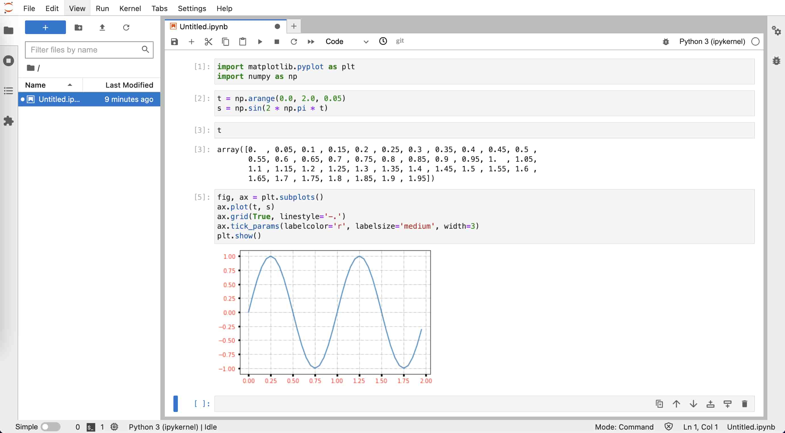

# Python 语言

- 本节贡献者: {{田冬冬}}、{{姚家园}}
- 最近更新日期: 2025-10-11
- 预计花费时间: 60 分钟

---

## 简介

[Python](https://www.python.org/) 是一种广泛使用的通用编程语言，其具有语法简单、功能强大等优点，
是目前地震学科研最常用的编程语言之一。

这一节中，我们不介绍具体的 Python 语法，而是着重介绍如何安装和管理 Python、如何编写并执行 Python 脚本
等。这一节的最后列出了一些免费的 Python 学习资源，读者可根据需要自行学习。

## 安装 Miniforge

Python 是一种解释型语言，需要专门的解释器去执行 Python 代码。尽管 Linux/macOS 系统内置了 Python
解释器，但是建议用户不要使用它，以免误操作破坏系统内置 Python，造成系统出现问题。
**建议用户安装 Miniforge，使用其提供的 `conda`/`mamba` 命令管理和安装 Python 及其模块。**

:::{dropdown} Python、Anaconda、Miniconda 与 Miniforge
:color: info
:icon: info

有一些 Python 使用经验的用户，可能接触或使用过 Anaconda、Miniconda 和 Miniforge。这其中涉及到很多
概念，下面做简要解释：

Python 解释器
: 从 [Python 官方网站](https://www.python.org/downloads/) 下载的 Python 安装包只提供了一个
  Python 解释器，仅包含 Python 的核心模块和库，是运行 Python脚本所必需的。使用官方的 Python 安装包
  相当于安装了 Python 解释器 + 核心模块/库。

Anaconda
: [Anaconda](https://www.anaconda.com/download) 是 [Anaconda 公司](https://www.anaconda.com/)
  提供的一个 Python **发行版**，其不仅提供了 Python 解释器，还内置了很多 Python 开发工具与众多科学
  计算相关的库，形成了一个可以开箱即用的 Python 科学计算环境，省去了自行配置科学计算环境的麻烦。Anaconda
  还提供了强大的软件包管理工具 `conda`，可以方便地安装模块和管理环境。安装 Anaconda 相当于安装了
  Python 解释器 + 核心模块/库 + 数百个科学计算相关模块 + 包管理器 `conda`。

  尽管 Anaconda 有很多优点，其也有明显的缺点：

  - 安装包非常大（超过 500 MB）
  - 安装过程耗时长（一般超过 5 分钟）
  - 安装后占用大量硬盘空间（一般超过 3 GB）
  - 安装了很多平时用不到的模块，进而导致安装新模块时会可能出现版本冲突

Miniconda
: [Miniconda](https://docs.anaconda.com/miniconda/) 是 Anaconda 公司提供的 Anaconda 的精简版。
  安装 Miniconda 相当于安装了 Python 解释器 + 核心模块/库 + 包管理器 `conda`。因而，其避免了
  Anaconda 的臃肿，安装包只有约 50 MB，安装通常也只需要数十秒。由于内置了包管理器 `conda`，可以根据
  自己的需求安装软件包，极大地避免了内置大量软件包导致的软件版本冲突的问题。

conda-forge
: Anaconda 公司在制作 Anaconda 发行版的同时，还维护了一个小型软件仓库，称之为 main channel。该软件
  仓库中仅包含了 Anaconda 公司感兴趣的几百个软件包，因而无法满足所有用户的需求。因而，一些有志之士成立了
  [conda-forge](https://conda-forge.org/) 社区，维护了另一个软件仓库，称之为 conda-forge channel。
  该软件仓库包含了近 3 万个软件包，以满足不同用户的需求。因而，大部分人通常都使用 conda-forge channel。
  但需要注意的是，某些软件包在 main 和 conda-forge channel 中同时存在，混用不同的 channel 可能会
  导致软件版本冲突。

Miniforge
: 为了避免混用 main 和 conda-forge channel 可能导致的软件冲突，conda-forge 社区制作了 Miniforge
  发行版。Miniforge 与 Miniconda 基本相同，因而安装 Miniforge 相当于安装了 Python 解释器 +
  核心模块/库 + 包管理器 `conda` 和 `mamba`。

  其与 Miniconda 不同的点在于：

  1. Miniforge 默认使用 conda-forge channel，即默认只从 conda-forge channel 中获取软件包，
     极大避免了混用 main 和 conda-forge channel 可能导致的版本冲突
  2. Miniforge 提供了包管理器 `mamba`，其与 `conda` 功能相同吗，但具有更好的性能。二者的具体区别在
     下面会介绍

因而，Miniforge 是目前推荐使用的 Python 发行版。
:::

下面展示了如何在 Linux 系统下安装 Miniforge。其它操作系统下的安装说明以及具体使用方法可以参考
[地震“学”软件中 conda 相关内容](inv:software:*:doc#conda/index)。

1. 下载 Miniforge

   下载地址：[Miniforge3-Linux-x86_64.sh](https://mirrors.tuna.tsinghua.edu.cn/github-release/conda-forge/miniforge/LatestRelease/Miniforge3-Linux-x86_64.sh)

2. 安装 Miniforge

   ```
   $ bash Miniforge3-Linux-x86_64.sh
   ```

   Miniforge 默认会安装到 {file}`${HOME}/miniforge3` 下，在安装过程中可以设置为其他路径。

   安装通常只需要十几秒，在安装的最后会出现：
   ```

   Do you wish to update your shell profile to automatically initialize conda?
   This will activate conda on startup and change the command prompt when activated.
   If you'd prefer that conda's base environment not be activated on startup,
   run the following command when conda is activated:

      conda config --set auto_activate_base false

   You can undo this by running `conda init --reverse $SHELL`? [yes|no]
   [no] >>>
   ```

   输入 `yes` 则安装包会向当前 SHELL 的配置文件写入 `conda` 初始化语句。

3. 测试安装

   打开一个新的终端，在终端中输入 `python`，输出中看到 `packaged by conda-forge` 字样即代表成功
   安装 Miniforge 并启动了 Python 解释器：
   ```
   $ python
   Python 3.12.8 | packaged by conda-forge | (main, Dec  5 2024, 14:25:12) [Clang 18.1.8 ] on darwin
   Type "help", "copyright", "credits" or "license" for more information.
   >>>
   ```

   在提示符 `>>>` 后输入 `quit()` 后按下 {kbd}`Enter` 键退出 Python 解释器。

## 初识 Python

打开终端，输入 `python` 就会进入 Python 解释器的交互模式：

```
$ python
Python 3.12.8 | packaged by conda-forge | (main, Dec  5 2024, 14:25:12) [Clang 18.1.8 ] on darwin
Type "help", "copyright", "credits" or "license" for more information.
>>>
```

进入 Python 解释器后，首先会显示 Python 版本信息、版权声明以及帮助信息，然后会显示符号 `>>>`。`>>>`
是 Python 解释器在交互模式下的主提示符，提示用户可以在 `>>>` 后输入 Python 指令。

在 `>>>` 提示符后输入 `1 + 2` 并按下 {kbd}`Enter` 键将指令 `1 + 2` 传给 Python 解释器。解释器
接收指令后会执行指令，输出结果 `3`，并再次显示主提示符 `>>>` 等待用户的下一次输入。
```python
>>> 1 + 2
3
>>>
```
:::{tip}
Python 解释器交互模式可以当做一个快捷的计算器来使用！
:::

下面继续看一个稍复杂点的例子。给变量 `x` 赋值，然后紧跟着一个判断语句“如果 x 的值大于 0，则打印字符串
Hello world!”。
```python
>>> x = 5
>>> if x > 0:
...     print("Hello world!")
...
Hello world!
>>>
```
这个判断语句无法在一行写完，因而需要写成多行语句。在主提示符后输入 `if x > 0:` 并按下 {kbd}`Enter` 键，
会显示符号 `...`。`...` 是 Python 解释器在交互模式下的次提示符，用于表明多行语句还没写完，需要继续输入。
在次提示符 `...` 后不输入指令而直接键入 {kbd}`Enter`，表示该代码块已结束。Python 解释器会对输入的多行
语句进行解释，并输出字符串“Hello world!”。
:::{note}
C 语言使用大括号 `{ }` 划分代码块，而 Python 中使用缩进划分代码块！因而上面的例子中 `print` 前需要用
空格缩进（通常是 4 个空格）。
:::

在主提示符 `>>>` 后输入 `quit()` 或者按下 {kbd}`Ctrl` + {kbd}`D` 键即可退出 Python 解释器的交互模式。
```python
>>> quit()
```

## Python 脚本

虽然在 Python 解释器的交互模式下可以执行 Python 代码，但写长代码非常不方便，其代码编辑功能很弱，也不
具备代码补全功能。更重要的是，退出交互模式后，之前写的 Python 代码不会保存，下次想要执行相同代码时
只能重写。因而，通常都不会在 Python 解释器的交互模式下写代码，而是将 Python 代码写到 Python 脚本中。

Python 脚本其实就是一个包含了一系列 Python 指令的文本文件，后缀通常是 `.py`，在终端中可以通过
`python xxxx.py` 的方式执行 Python 脚本（`xxxx.py` 是 Python 脚本的文件名）。

下面以一个简单的 Python 脚本作为示例。启动文本编辑器，新建一个文件，将以下 Python 代码写到文件中：
```python
x = 5
if x > 0:
    print("Hello world!")
```
将文件保存为后缀 `.py` 的文件（比如 {file}`first-script.py`），即得到了一个可执行的 Python 脚本。
打开终端，切换到 Python 脚本所在的目录，执行如下命令来运行脚本：
```
$ python first-script.py
Hello world!
```

## 安装 Python 包

Python 语言的一大特色是其功能强大的标准库和第三方软件包（也称模块或库）。Python 解释器内置了所有
标准库，安装解释器后就可以直接使用标准库，而第三方包需要先安装才能使用。

:::{admonition} `pip`、`conda` 与 `mamba`

学习如何安装 Python 包之前，有必要先了解 `pip`、`conda` 和 `mamba`，以及它们之间的区别与联系:

[`pip`](https://pip.pypa.io/)
: `pip` 是 Python 官方提供的包管理器，可以安装 [Python 包索引网站](https://pypi.org/) 上的 Python 包，
  也可用于从源码安装 Python 包。

[`conda`](https://docs.conda.io/)
: `conda` 是由 Anaconda 公司开发和维护的软件包管理器，其不仅可以安装 Python 包，还可以安装其他语言
  写的包（理论上可以安装任何软件）。它的另一个重要功能是管理 Python 环境，可用于在一个系统内安装多个
  不同版本的 Python 解释器或包。

  Anaconda、Miniconda 和 Miniforge 发行版中都内置了 `conda`。

[`mamba`](https://mamba.readthedocs.io/)
: `mamba` 是由 QuantStack 公司开发的 `conda` 替代品。其用法与 `conda` 几乎完全兼容，但其不管是
  依赖解析速度还是软件包下载速度都更快。

  Miniforge 发行版内置了 `mamba`。Anaconda 和 Miniconda 发行版中也可以使用 `conda` 命令
  安装 `mamba`。
:::

在使用 `conda`/`mamba` 前，还需要对 `conda`/`mamba` 做简单配置：
```
# 配置使用国内清华源以加快软件下载速度
$ conda config --set 'custom_channels.conda-forge' https://mirrors.tuna.tsinghua.edu.cn/anaconda/cloud
```

**推荐优先使用 `mamba` 安装和管理 Python 包。对于无法使用 `mamba` 安装的包，再使用 `pip` 安装。**

使用 `mamba` 安装软件很简单，直接 `mamba install` 加上要安装的软件包名称即可。
`mamba` 可安装的软件包位于 [Anaconda 网站](https://anaconda.org/)。

读者可以执行如下命令，安装本节余下内容会用到的几个 Python 包：
```
$ mamba install numpy matplotlib jupyterlab
```

对于 [Anaconda 网站](https://anaconda.org/) 没有的包，则只能使用 `pip` 安装。

## Jupyter Notebook

前面介绍了如何在 Python 解释器交互模式执行 Python 代码，也介绍了如何将 Python 代码写成脚本并执行。
这两种方式各有优缺点：交互模式下编写代码不方便，但是可以一句一句执行代码，随时检查某个语句的输出或
某个变量的值。编写 Python 脚本可以在编辑器中完成，因而写代码更加高效，但执行 Python 脚本时只能从头
到尾执行，每次修改代码后都需要重新执行脚本里的所有代码，因而调试起来很费时。

[JupyterLab](https://jupyter.org/) 是一个基于网页的交互式开发环境，已经成为当前最流行的 Python 开发
环境。它将两种方式的优点结合起来，可以高效地编辑代码、单步执行代码、随时查看变量值、支持丰富的可视化
输出。JupyterLab 对应的文件称之为 Notebook，其文件后缀是 `.ipynb`。下面将通过实例展示如何使用
JupyterLab。

打开终端，键入命令 `jupyter-lab`，启动 JupyterLab。

```bash
$ jupyter-lab
```

JupyterLab 会在浏览器中打开一个标签页，显示启动界面。如下图所示，启动界面有若干图标，可以用于创建
Notebook、纯文本文件、Markdown 文件或 Python 文件，还可以在浏览器中打开一个终端。


点击“Notebook”下的图标创建一个空白的 Notebook，文件名默认为 `Untitled.ipynb`。如下图所示，左侧为
文件浏览器，右侧为新建的 Notebook，光标所在的矩形区域称之为单元格（cell），可以用于输入 Python 代码。
在单元格中输入代码，按下 {kbd}`Shift` + {kbd}`Enter` 执行单元格中的代码。


下面的两行代码会导入 NumPy 和 Matplotlib 包。将这两行代码复制到 Notebook 的单元格中，按下
{kbd}`Shift` + {kbd}`Enter` 执行：
```python
import matplotlib.pyplot as plt
import numpy as np
```

下面的代码设置 `t` 取值为 0 到 2.0，间隔为 0.05，然后利用函数 {math}`s = \sin(2 \pi t)` 生成了一系列点。
将这两行代码复制到 Notebook 的单元格中，按下 {kbd}`Shift` + {kbd}`Enter` 执行：
```python
t = np.arange(0.0, 2.0, 0.05)
s = np.sin(2 * np.pi * t)
```

想要看看变量 `t` 的值？很简单，在单元格中输入变量 `t`，按下 {kbd}`Shift` + {kbd}`Enter`，Notebook
会直接显示该变量的值。如下图所示，可以看出，变量 `t` 是一个数组，其最小值是 0，间隔是 0.05，最大值是
1.95（不包括 2.0）：


下面的代码将以变量 `t` 作为自变量（X 轴）、以变量 `s` 作为因变量（Y轴）绘制该函数。将代码复制到
单元格中，按下 {kbd}`Shift` + {kbd}`Enter` 执行：
```python
fig, ax = plt.subplots()
ax.plot(t, s)
plt.show()
```

执行效果如下图所示，绘图结果直接在 Notebook 里显示，非常直观。


对画出来的图片效果不太满意，想要进一步微调图片的显示效果？下面的两行代码会给图片加上网格线，并设置
刻度颜色、大小、宽度。
```python
ax.grid(True, linestyle='-.')
ax.tick_params(labelcolor='r', labelsize='medium', width=3)
```
将上面两行代码复制到前一单元格中的 `plt.show()` 语句之前，按下 {kbd}`Shift` + {kbd}`Enter` 执行，
效果如下图所示：



可以看到，修改后的代码被执行，并显示了修改后的图片。在执行修改后的代码时，变量 `t` 和 `s` 依然有效，
不需要重新执行之前单元格中的代码。实际上，只要 Kernel 没有重启，Notebook 中的变量就不会被销毁，因而
可以很方便地多次修改并调试某个单元格的代码。

:::{tip}
在 Notebook 中写代码时，可以随时用快捷键 {kbd}`Ctrl` + {kbd}`S` （Linux 或 Windows）或
{kbd}`Command` + {kbd}`S` （macOS）保存 Notebook。所有代码、输出以及图片都会被保存在 `.ipynb` 文件中。
:::

:::{tip}
Notebook 在交互式开发代码时很方便。但通常我们会想要将代码保存为 Python 脚本，更加方便执行。在
JupyterLab 中点击菜单“File”→“Save and export Notebook as”→“Executable Script” 即可将 Notebook
转换为 Python 脚本。
:::

JupyterLab 除了可以编辑 Notebook 外，还可以编辑 Markdown 文件，也可以打开终端执行命令，还支持多个
功能强大的插件。更多的功能，留待读者自行探索。

## 其他 Python IDE/开发环境

除了上面介绍的 JupyterLab 外，还有其他方便、实用的 Python IDE/开发环境，例如：

- [Visual Studio Code](https://code.visualstudio.com/docs/python/python-tutorial)
	- [在 Visual Studio Code 里交互式编辑和运行 Jupyter Notebooks](https://code.visualstudio.com/docs/datascience/jupyter-notebooks)
	- [在 Visual Studio Code 里交互式编辑和运行 Python 脚本](https://code.visualstudio.com/docs/python/jupyter-support-py)
- [PyCharm](https://www.jetbrains.com/pycharm/)
- [Spyder](https://www.spyder-ide.org/)

有兴趣的读者可以尝试不同的 Python IDE/开发环境并根据自己的喜好选择。

## 扩展阅读

下面列出一些 Python 以及常用科学计算模块的相关学习资源：

- [Python](https://www.python.org/)
  - [Python 官方文档](https://docs.python.org/zh-cn/3/)（全面、系统）
  - [廖雪峰的 Python 教程](https://www.liaoxuefeng.com/wiki/1016959663602400)（较全面、系统）
- [NumPy](https://numpy.org/)
  - [NumPy 官方文档](https://numpy.org/doc/stable/)
  - [A Visual Intro to NumPy and Data Representation](https://jalammar.github.io/visual-numpy/)（简要、形象地介绍 NumPy 数据结构）
- [Matplotlib](https://matplotlib.org/)
  - [Matplotlib 官方教程](https://matplotlib.org/stable/tutorials/)
  - [Scientific Visualization: Python + Matplotlib](https://github.com/rougier/scientific-visualization-book)
- [pandas](https://pandas.pydata.org/)
  - [Pandas 官方教程](https://pandas.pydata.org/docs/user_guide/)
- [SciPy](https://scipy.org/)
  - [SciPy 官方教程](https://docs.scipy.org/doc/scipy/tutorial/)
