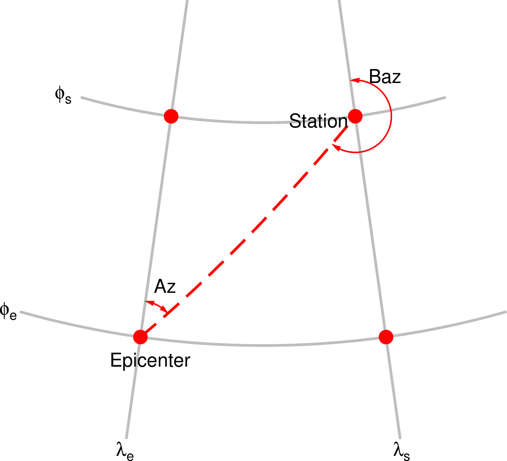

地震仪
======

距离和角度
----------

震中距
++++++

地震、球面上任意一点和球心所在的球面圆形称为大圆（*great circle*）。
大圆由从震中到这一点的小圆弧（*minor arc*）和大圆弧（*major arc*）
两部分组成。

震中距指震中到地面上任意一点的球面距离，即小圆弧或大圆弧的长度，单位一般
为度或公里等。除非显示申明，一般默认是小圆弧长度。

方位角和反方位角
++++++++++++++++

方位角是震中到台站的连线与地理北向的夹角，而反方位角指台站到震中的连线与地理北向的夹角。

   震中距、方位角、反方位角示意图

出射角和入射角
++++++++++++++

射线从震源出射时，与垂直方向的角度。例如，从震源正下方出射的射线的出射角为 0°。

射线入射到台站时，与垂直方向的角度。例如，从台站正下方入射的射线的入射角为 0°。

.. note::

   不同软件对出射角和入射角的定义可能会有区别。例如，``taup_time`` 定义出射角为
   射线从震源出射时与\ **垂直向下**\ 方向的夹角，而入射角为射线入射到台站时
   与\ **垂直向上**\ 方向的夹角。
