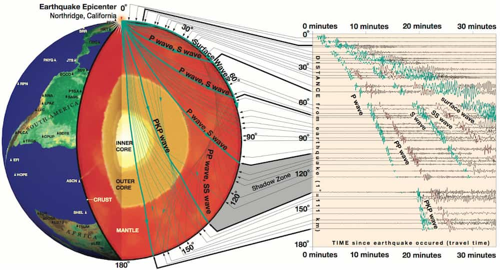

简介
====

:本节贡献者: |姚家园|\（作者）、
             |田冬冬|\（作者）
:最近更新日期: 2021-04-23
:预计阅读时间: 10 分钟

----

地震学是什么？
--------------

Keiiti Aki 和 Paul G. Richards 编写的经典地震学教材
《Quantitative Seismology: Theory and Methods》对地震学的定义如下：

  **Seismology is a science based on data called seismograms,
  which are records of mechanical vibrations of the Earth.**

  地震学是一门基于记录着地球机械振动的地震图的科学。

  **These vibrations may be caused artificially by man-made explosions,
  or they may be caused naturally by earthquakes and volcanic eruptions.**

  振动可能是人工爆炸造成的，也可能是地震和火山喷发造成的。

可以看出，地震学的研究工具是地震图，即地震仪记录的地球机械振动，而产生这些振动的源
（一般称为\ **震源**\ ）可能是人工爆炸、地震和火山喷发等。震源激发的地球机械振动
（一般称为\ **地震波**\ ）传播到地球内部，并最终被布设在地表或地下的地震仪
（一般称为\ **地震台站**\ 或简称\ **台站**\ ） 记录下来。

1994 年 1 月 17 日，美国加利福尼亚州 Northridge 附近发生了 `6.7 级地震 <https://earthquake.usgs.gov/earthquakes/eventpage/ci3144585/>`__，
其释放出的能量相当于将近 20 亿千克高爆炸药。该地震产生的地震波经过地球内部传播后，
被世界各地的地震台站记录到。一些地震波的传播路径以及全球台站记录的地表振动如下图所示。

   引自 `Exploring the Earth Using Seismology <https://www.iris.edu/hq/inclass/fact-sheet/exploring_earth_using_seismology>`__

因此，地震图携带了震源和地球内部结构的信息，地震学家正是通过分析地震图来研究产生这些振动的
震源以及地球内部结构。地震学研究的基本原理则是地震波理论，包括震源和波传播两个部分，
前者主要关于震源如何激发地震波，后者主要有关地震波如何在地下传播。

地震与地震学
------------

地震学的英文单词是 Seismology，地震的英文单词是 Earthquake。由于中文翻译的问题，
非地震学专业的学者或大众可能会混淆地震学和地震两个概念，认为地震学就是关于地震的学科。
从上文的定义就可以看出，地震只是地震学的一个重要部分。任何产生能被地震仪记录到的地球机械
振动的源都可以是地震学的研究对象，比如人工爆炸、火山喷发、人类活动、风等。
这些震源产生地震波，被地震台记录后，也可以用于研究地下结构和其本身。

推荐学习资料
------------

本教程只是地震学初学者的入门读物，入门后还需参考一些系统和全面的学习资料进行深入学习，
推荐以下参考资料：

- :doc:`地震“学”参考书 <seis:index>`

  - 作者：\ `地震“学”小组 <https://github.com/orgs/seismo-learn/people>`__
  - 难度：正在缓慢编写中，难度未知

- `Introduction to Seismology <https://www.cambridge.org/us/academic/subjects/earth-and-environmental-science/solid-earth-geophysics/introduction-seismology-3rd-edition?format=HB&isbn=9781316635742>`__\ ：

  - 作者：\ `Peter Shearer <https://igppweb.ucsd.edu/~shearer/mahi/>`__
  - 难度：浅显易懂，非常适合初学者，如大三、大四本科生

- `An Introduction to Seismology, Earthquakes, and Earth Structure <https://www.wiley.com/en-us/An+Introduction+to+Seismology%2C+Earthquakes%2C+and+Earth+Structure-p-9780865420786>`__

  - 作者：\ `Seth Stein <https://www.earth.northwestern.edu/our-people/faculty/stein-seth.html>`__
    和 `Michael Wysession <https://eps.wustl.edu/people/michael-e-wysession>`__
  - 难度：难度适中，有很多简单和实用的公式推导，适合初学者以及地震学研究生

- `Modern Global Seismology <https://www.elsevier.com/books/modern-global-seismology/lay/978-0-12-732870-6>`__

  - 作者：\ `Thorne Lay <https://websites.pmc.ucsc.edu/~seisweb/thorne_lay/>`__
    和 Terry Wallace
  - 难度：较难，适合有一定地震学和数理基础的研究生

- `Quantitative Seismology <https://www.ldeo.columbia.edu/~richards/Aki_Richards.html>`__

  - 作者：\ `Keiiti Aki <https://www.nature.com/articles/4351176a>`__
    和 `Paul G. Richards <https://www.ldeo.columbia.edu/user/richards>`__
  - 难度：很难，大量公式推导，被称为地震学圣经，适合高年级研究生以及地震学学者

- `Theoretical Global Seismology <https://press.princeton.edu/books/paperback/9780691001241/theoretical-global-seismology>`__

  - 作者：F. A. Dahlen 和 `Jeroen Tromp <https://geosciences.princeton.edu/people/jeroen-tromp>`__
  - 难度：很难，大量公式推导，注重面波和自由震荡理论，适合高年级研究生以及地震学学者
