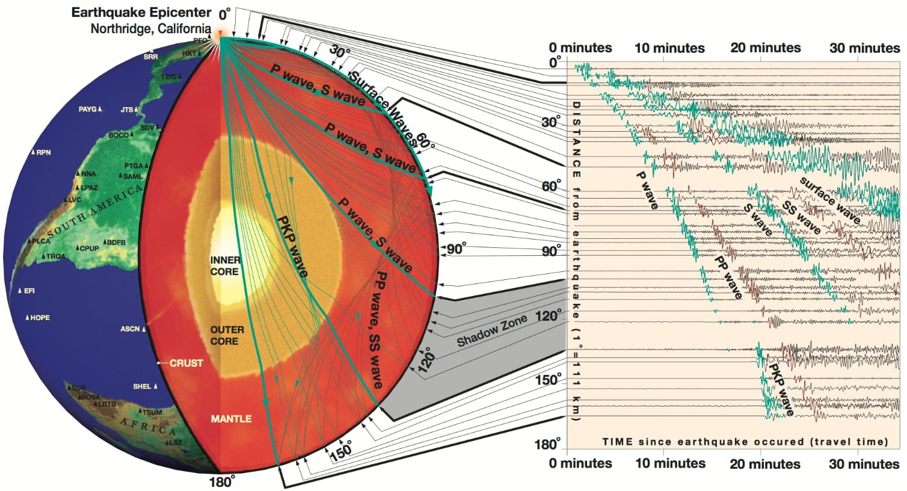

简介
====

:本节贡献者: |姚家园|\（作者）、
             |田冬冬|\（作者）
:最近更新日期: 2021-04-25
:预计阅读时间: 10 分钟

----

地球科学的研究手段主要有三种，即物理、化学以及生物。地球科学的研究对象大体有：
地球的固体部分（固体地球）、地球表面上下的水（水圈）、生态系统（生物圈）、大气层（大气圈）、
地球至太阳的行星际空间。使用物理方法研究地球的学科称为地球物理学（geophysics），
而固体地球物理学则是研究固体地球的分支学科。固体地球物理学的研究方法较多，如地震波、重力、
电磁、地热等，不同方法形代表了不同专业。因此，从整个地球科学研究的角度来看，地震学只是一个
较小的专业方向，同时又是非常重要的研究手段。本章仅介绍地震学的基础入门知识。

地震学是什么？
--------------

Keiiti Aki 和 Paul G. Richards 编写的经典地震学教材《Quantitative Seismology》（第二版）
对地震学的定义如下：

  **Seismology** is the scientific study of mechanical vibrations of the Earth.
  Quantitative seismology is based on data called seismograms,
  which are recordings of the vibrations,
  which in turn may be caused artificially by man-made explosions,
  or caused naturally by earthquakes and volcanic eruptions.

  地震学是研究地球机械振动的科学。定量地震学基于记录着这些振动的观测资料，即地震图。
  这些振动可能是由人工爆炸等人为因素引起的，也可能是地震和火山喷发等自然活动造成的。

地震学是研究地球机械振动的科学。地震学的研究工具是\ **地震图**\ （seismogram），
即仪器记录的地球机械振动。产生这些振动的源（seismic source，一般称为\ **震源**\ ）
可能是地震、火山喷发、海浪、台风或飓风、人工爆炸、交通活动等。
常用\ **地震事件**\ （seismic event）或\ **事件**\ （event）指代震源，
需要注意的是地震事件不一定必须指代地震，也可以指代以上其他震源。
震源激发的地球机械振动（seismic wave，一般称为\ **地震波**\ ）传播到地球内部，
并最终被布设在地表或地下的地震仪（seismograph）记录下来。一般常称地震仪为\
**地震台站**\ （seismic station），或简称\ **台站**\ （station）。

   1994 年 1 月 17 日，美国加利福尼亚州 Northridge 地震激发的地震波的传播路径和观测波形。
   引自 `Exploring the Earth Using Seismology <https://www.iris.edu/hq/inclass/fact-sheet/exploring_earth_using_seismology>`__\ 。

1994 年 1 月 17 日，美国加利福尼亚州 Northridge 附近发生了 `6.7 级地震 <https://earthquake.usgs.gov/earthquakes/eventpage/ci3144585/>`__，
其释放出的能量相当于将近 20 亿千克高爆炸药。该地震产生的地震波经过地球内部传播后，
被世界各地的地震台站记录到。上图左侧展示了不同地震波在地下的传播路径，右侧展示了地震波到达
地表后，全球台站记录到的地表振动，即地震图。

因此，地震图携带了震源和地球内部结构的信息，地震学家正是通过分析地震图来研究产生这些振动的
震源以及地球内部结构。地球平均半径约为 6371 公里，现在很难直接观测地球内部，
历史上最深的钻探深度也不过只有十多公里。因此，地震学是目前人类探测地球深部结构的主要手段，
许多最重大的地球内部发现都是地震学研究报道的。

地震学研究的基本原理包括震源和地震波理论两个部分，前者主要关于震源和地震波的激发，
后者主要关于地震波如何在地下传播。地震学理论背后的大部分物理知识不过是牛顿第二定律 :math:`F=ma`\ ，
当然实际问题的复杂性促使了地震学家利用复杂的数学技巧以及计算机的广泛应用。一般而言，地震学
是观测驱动的学科，仪器和数据可用性的改进常常会导致地震学理论和地球内部结构研究的重大突破。

地震学与地震
------------

大众或非地震学专业的学者可能会混淆地震学和地震这两个概念，认为地震学就是关于地震的科学，
其实并非如此。地震学的英文单词是 Seismology，地震的英文单词是 Earthquake。
Seismology 源自古希腊语，原意的确是地震的科学，但现代地震学的研究对象已经不仅仅只是地震了。
从上文的定义可以看出，任何产生\ **能被地震仪记录到的地球机械振动**\ 的源都是地震学的研究对象，
如火山喷发、海浪、台风或飓风、人工爆炸、人类活动、交通活动等。
这些震源产生的地震波被地震台记录后，也可以用于研究地下结构和其本身。

地震学早期大事记
----------------

地震学是一个相对年轻的学科，从二十世纪初才逐渐开始定量化的研究。
可以查阅 `History of Seismology <https://www.iris.edu/hq/inclass/poster/history_of_seismology>`__
了解更多地震学历史，以下仅简要介绍部分重要历史事件。

在早期，理论发展领先地震学观测。1892 年，Love 出版了经典教材《A Treatise on the Mathematical Theory of Elasticity》（第一版），
简介中详细描述了弹性理论的发展历史（1927 年出版了 `第四版 <https://www.cambridge.org/us/academic/subjects/mathematics/historical-mathematical-texts/treatise-mathematical-theory-elasticity-4th-edition?format=PB&isbn=9781107618091>`__\ ）。
以下介绍地震波理论的早期进展：

- 弹性理论（elasticity theory）的两个重要发现：胡克定律（Hooke，1660 年）、
  弹性介质的一般性平衡和运动方程（Navier，1821 年）
- 从十八世纪早期开始，弹性波传播理论（the theory of elastic wave propagation）
  由 Cauchy、Poisson、Green、Stokes、Rayleigh 等人发展

从十九世纪后期开始，地震学观测开始逐渐发展起来，极大地促进了地震学的发展。
以下介绍地震学观测的早期进展：

- 1875 年，Filippo Cecchi 制作了第一个带时间记录的地震仪。随后，地震仪器不断改善和发展
- 20 世纪初，B. B. Galitzen 制作了第一台电磁地震仪。现代地震仪均是电磁地震仪，
  相比于早期的纯力学设计的仪器，其有很多优势
- 1961 年，全球标准化地震台网（world-wide standardized seismograph network，WWSSN）建立
- 1969 年至 1972 年间，阿波罗登月计划还陆续在月球上部设了一些地震仪
- 20 世纪 60 年代开始，计算机的来临极大地改变了地震学研究
- 1976 年开始，地震学观测资料开始以数字形式存储和获取
- 20 世纪 80 和 90 年代，全球台站空白区域新增加了地震台，全球许多地震台升级为宽频带地震仪。
  地震仪的改进与观测资料的长期积累使得地震学得以快速发展

在地震学理论和观测的早期发展过程中，地球内部结构也取得了一系列重大突破：

- 1906 年，Richard Oldham 报道地球存在地核
- 1909 年，Andrija Mohorovičić 报道地壳和地幔存在速度间断面（现在称为 Moho 面）
- 1914 年，Beno Gutenberg 报道地幔和液态地核的边界深度为 2900 公里，
  非常接近当今的估计值 2889 公里
- 1936 年，Inge Lehmann 发现固态内核（之前认为地核全是液态的）
- 1940 年，Harold Jeffreys 和 K. E. Bullen 发表了他们最终版本的地震波走时表，
  简称 JB 走时表。该走时表至今仍在使用，并且与当今模型仅差几秒

此外，这里列出部分其他的早期进展：

- 20 世纪 20 和 30 年代，爆炸等人工震源开始应用在石油勘探行业。
  1956 年，如今地震勘探常用的共中心点叠加（common-midpoint stacking）技术获取专利
- 20 世纪初，可以对大地震进行常规定位。因此，发现了地震并不是随机分布，
  而是发生在一些特定的条带状区域
- 1923 年，H. Nakano 引入了双力偶源（double-couple source）理论
- 1928 年，Kiyoo Wadati 首先报道了深震（深度大于 100 公里）的可靠证据
- 1935 年，Charles Richter 和 Beno Gutenberg 提出了第一个广泛使用的地震震级，
  即里氏震级。现在地震学领域称之为区域震级（local magnitude）
- 1960 年，观测到智利大地震激发的地球自由震荡（free oscillations），这是第一次
  确定性观测到地球自由震荡
- 20 世纪 60 年代，地震学家发现全球大部分地震的震源机制（focal mechanism）
  与板块构造理论一致，帮助证实了当时处于新兴阶段的板块构造理论
- 1970 年前，已经很好地确定了地震波速度和密度在地球内部随深部的分布。
  之后至今，地震学家致力于研究三维速度结构

推荐学习资料
------------

本教程只是地震学初学者的入门读物，阅读完本教程后还需参考一些系统和全面的资料进行深入学习。
推荐以下参考资料：

- 《\ `Introduction to Seismology <https://www.cambridge.org/us/academic/subjects/earth-and-environmental-science/solid-earth-geophysics/introduction-seismology-3rd-edition?format=HB&isbn=9781316635742>`__\ 》
  （第三版）

  - 作者：\ `Peter Shearer <https://igppweb.ucsd.edu/~shearer/mahi/>`__
  - 难度：浅显易懂，非常适合初学者，如大三、大四本科生

- 《\ `An Introduction to Seismology, Earthquakes, and Earth Structure <https://www.wiley.com/en-us/An+Introduction+to+Seismology%2C+Earthquakes%2C+and+Earth+Structure-p-9780865420786>`__\ 》

  - 作者：\ `Seth Stein <https://www.earth.northwestern.edu/our-people/faculty/stein-seth.html>`__
    和 `Michael Wysession <https://eps.wustl.edu/people/michael-e-wysession>`__
  - 难度：难度适中，有很多简单和实用的公式推导，适合初学者以及地震学研究生

- 《\ `Modern Global Seismology <https://www.elsevier.com/books/modern-global-seismology/lay/978-0-12-732870-6>`__\ 》

  - 作者：\ `Thorne Lay <https://websites.pmc.ucsc.edu/~seisweb/thorne_lay/>`__
    和 Terry Wallace
  - 难度：较难，适合有一定地震学和数理基础的研究生

- 《\ `Quantitative Seismology <https://www.ldeo.columbia.edu/~richards/Aki_Richards.html>`__\ 》（第二版）

  - 作者：\ `Keiiti Aki <https://doi.org/10.1785/gssrl.76.5.551>`__
    和 `Paul G. Richards <https://www.ldeo.columbia.edu/user/richards>`__
  - 难度：很难，大量公式推导，被称为地震学圣经，适合高年级研究生以及地震学学者

- 《\ `Theoretical Global Seismology <https://press.princeton.edu/books/paperback/9780691001241/theoretical-global-seismology>`__\ 》

  - 作者：F. A. Dahlen 和 `Jeroen Tromp <https://geosciences.princeton.edu/people/jeroen-tromp>`__
  - 难度：很难，大量公式推导，注重面波和自由震荡理论，适合高年级研究生以及地震学学者
