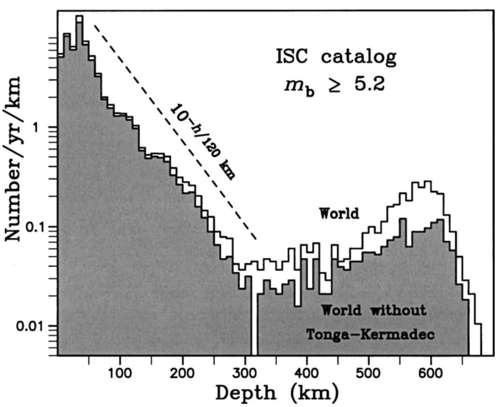

震源
====

:本节贡献者: |姚家园|\（作者）、
             |田冬冬|\（审稿）
:最近更新日期: 2021-05-31
:预计阅读时间: 5 分钟

----

任何产生能被地震仪记录到的地球机械振动的源都可以称为震源（seismic source），可能是地震、
火山喷发、海浪、台风或飓风、人工爆炸、交通活动等。本节介绍震源的基础概念。

震源表示
--------

.. note::

   本小节尚未开始编写。

地震三要素
----------

对于地震，人们最关心的基本参数有三个（俗称\ **地震三要素**\），即时间、地点、强度（简称\ **时空强**\ ）：

- 时间：地震发生时间（origin time），常采用协调世界时（即 Coordinated Universal Time，简写 UTC）
- 地点：地震发生位置（hypocenter），其向上垂直投影到地面的位置称为震中（epicenter）
- 强度：地震的大小，常用震级（magnitude）表示

横向上看，地震大部分发生在不同板块的边界处。板块内部也有一些地震发生。

.. figure:: earthquake-distribution.jpg
   :alt: 五年内 4 级以上地震的全球分布
   :width: 70%
   :align: center

   五年内 4 级以上地震的全球分布。
   引自 `Why Do Earthquakes Happen? <https://www.iris.edu/hq/inclass/fact-sheet/why_do_earthquakes_happen>`__\ 。

垂向上看，地震主要发生在脆性地壳中。在 300 公里以上，地震数目整体上随着深度增加而减少。
300 公里以下，地震数目略有增加。最大的地震深度约为 700 多公里。

   1964-2001 年全球 5.2 级以上地震的年发生率和震源深度的关系。
   引自《\ `Deep Earthquakes <https://doi.org/10.1017/CBO9781107297562>`__\ 》图 4.3。

震级越大的地震，数目越少。震级增加一级，地震释放的能量增加 32 倍。
一般 4 级以下的地震破坏能力较小，一些重要的全球地震目录也只收录 5 级以上的地震。

.. figure:: earthquake-energy.jpg
   :alt: 地震的震级、频率以及释
   :width: 90%
   :align: center

   地震的震级、频率以及释放能量的经验关系。
   引自 `How Often Do Earthquakes Occur? <https://www.iris.edu/hq/inclass/fact-sheet/how_often_do_earthquakes_occur>`__\ 。

