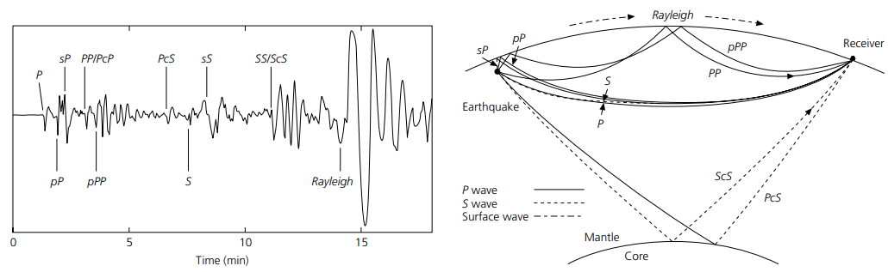
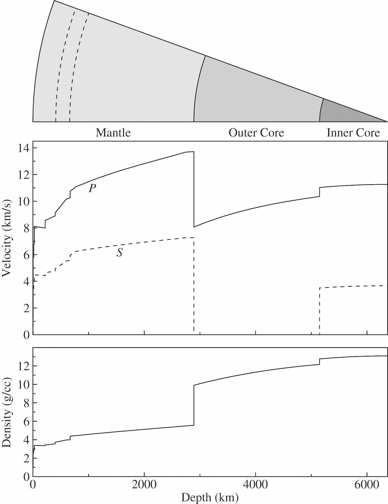
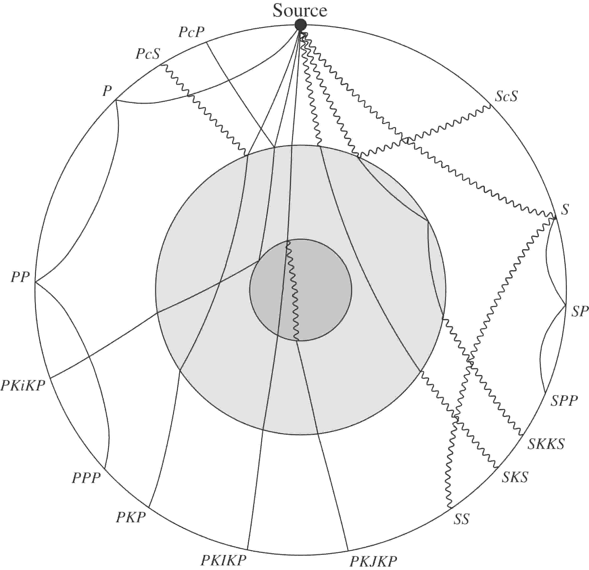
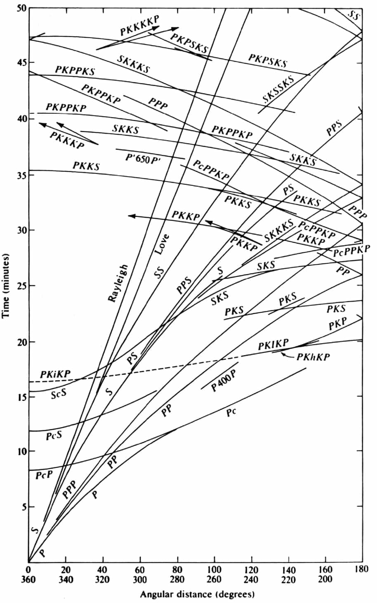
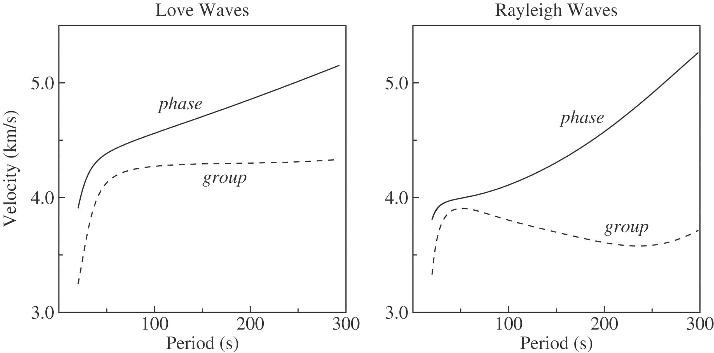

地震波
======

:本节贡献者: |姚家园|\（作者）、
             |田冬冬|\（审稿）
:最近更新日期: 2021-05-30
:预计阅读时间: 20 分钟

----

地震波（seismic wave）是在地球内部传播的机械波，由地震、火山喷发、山体滑坡或
人为爆炸等震源激发。地震波分为体波（body wave）和面波（surface wave）。
体波是指在地球内部传播的地震波，而面波指在地球表面附近传播的地震波。
如下图所示意，体波（如 P、pP、S、ScS 等）一般先于面波到台站，
而面波(如 Rayleigh)振幅一般比体波要大。本节将介绍最基础的地震波理论。

   体波和面波的波形和传播路径实例。
   引自《\ `An Introduction to Seismology, Earthquakes, and Earth Structure`_\ 》
   图 1.1-3。

体波
-----

P 波与 S 波
^^^^^^^^^^^^

体波分为 P 波（\ **p**\ rimary wave 或 P-wave）和 S 波（\ **s**\ econdary wave 或 S-wave）。
P 波比其他地震波传播速度快，最先传播到达台站；S 波的传播速度比 P 波慢，在 P 波后传播到台站。
上述 P 波和 S 波的命名源由主要基于他们到达台站的时间。
从物理属性上来说，P 波是压缩波（compressional wave），这是因为 P 波在地下介质中传播时，
会造成介质的交替压缩和膨胀，介质的体积发生变化（如下图示）；S 波是剪切波（\ **s**\ hear wave），
这是因为 S 波在地下介质中传播时，会造成介质的剪切变形，但介质的体积没有变化（如下图示）。

P 波之所以会造成介质的交替压缩和膨胀，是由于介质的运动方向与波传播的方向相同或相反。
因此，P 波是一种纵波（longitudinal wave），即介质的运动方向与波传播的方向相同或相反的波。
S 波之所以会造成介质的剪切变形，是由于介质的运动方向与波传播的方向垂直。
因此，S 波是一种横波（transverse wave），即介质的运动方向与波传播的方向垂直的波。

.. figure:: body-wave-propagation.jpg
   :alt: 体波的介质运动方向以及波传播方向
   :width: 80%
   :align: center

   体波的介质运动方向以及波传播方向。引自《\ `Introduction to Seismology`_\ 》（第三版）图 3.2。

地球分层
^^^^^^^^

固体地球的半径约为 6371 公里。最外层是较薄的地壳（crust），大洋地壳的平均厚度约为 6 公里，
大陆地壳则约为 30-50 公里。地球深部按照地震波速度又可以分成三层，即地幔（mantle）、
外核（outer core）、内核（inner core）：

- 地幔是固态的，深度约为 2891 公里，大约占地球体积的 84%，占地球质量的 68%
- 外核是液态的，地球磁场是由外核对流形成的
- 内核是固态的，半径约 1221 公里，由液态外核固化形成

固体地球各层的分界面命名如下：

- 地壳与地幔的边界：莫霍洛维奇间断面（\ **Moho**\ rovičić discontinuity），或简称莫霍面（Moho discontinuity）
- 地幔和外核的边界：核幔边界（\ **c**\ ore-\ **m**\ antle **b**\ oundary，简写 CMB）
- 外核与内核的边界：内核边界（\ **i**\ nner-\ **c**\ ore **b**\ oundary，简写 ICB）

   地球内部 P 波速度、S 波速度和密度（来自 Preliminary Reference Earth Model (PREM)）。
   引自《\ `Introduction to Seismology`_\ 》（第三版）图 1.1。

体波波速
^^^^^^^^

虽然体波同时由震源激发，但 P 波和 S 波的传播速度不同，例如，泊松体的 P 波速度是 S 波速度的
:math:`\sqrt{3}` 倍。P 波和 S 波传播速度也随深部而变化：

- 在 Moho 面附近，地震波猛然增加
- 在地幔中，410 公里和 660 公里附近存在两个速度间断面，地震波速度在间断面附近突然增加
  这两个间断面分别称为 410 间断面（410-km discontinuity）和 660 间断面（660-km discontinuity），
  他们之间的区域称为地幔转换带（mantle transition zone）。

- 在 660 公里至地幔底部的深部区域，地震波速度平缓增加
- 在核幔边界，P 波速度从大约 14 km/s 骤降至大约 8 km/s，S 波速度从大约 7 km/s 降为零，
  这是因为外核是液态的
- 在外核中，P 波速度再次随着深度逐渐增加
- 在内核边界，P 波速度突然增加，内核中 S 波速度也不为零了

   全球震相的射线路径及其震相名。实线表示 P 波路径，摆动线表示 S 波路径。
   引自《\ `Introduction to Seismology`_\ 》（第三版）图 4.16。

震相
^^^^^

地球内部不同的分层（地壳、地幔、外核、内核等）以及两种体波类型（P 波和 S 波）会产生许多
可能的几何射线（geometric ray），也称震相（seismic phase）。地震学领域有统一的震相的
命名规则。其中，地壳震相的命名规则相对复杂，且部分震相的命名并未统一。因此，本教程不做介绍，
读者可以参考\ :doc:`seis:ray-theory-travel-times/ray-nomenclature/crustal-phases`\
学习相关震相定义。以下介绍全球尺度下的震相命名规则。

为了方便命名震相，我们用以下特殊简写表示地壳、地幔、外核以及内核中的 P 波和 S 波路径：

- **P**\ ：地壳和地幔中的 P 波
- **K**\ ：外核中的 P 波
- **I**\ ：内核中的 P 波
- **S**\ ：地壳和地幔中的 S 波
- **J**\ ：内核中的 S 波
- **c**\ ：核幔边界的反射波
- **i**\ ：内核边界的反射波

地震波从震源传播到台站的过程中，我们可以多次使用以上简写来表示射线路径，也就命名了相关震相。
例如，PcP 震相表示震源激发的 P 波在核幔边界处反射，然后再传播至台站；SKS 表示震源激发的
S 波在核幔边界处转换为 P 波传播至外核中，然后再次在核幔边界处转换回 S 波传播回地幔，最后
传播到台站。

我们以地震与台站之间的距离为 x 轴，以台站观测到的地震震相走时为 y 轴，将全球地震的震相走时
画出来，便得到了\ **走时曲线**\ 。这是我们认识和研究地球深部的速度结构最简单和根本的资料。

   不同体波震相的走时曲线，数据来至 `Kennett and Engdahl (1991) <https://doi.org/10.1111/j.1365-246X.1991.tb06724.x>`__\ 。
   引自《\ `An Introduction to Seismology, Earthquakes, and Earth Structure`_\ 》
   图 3.5-3。

面波
-----

Rayleigh 波和 Love 波
^^^^^^^^^^^^^^^^^^^^^^

沿着地球表面附近传播的面波也有两种，即瑞利波（Rayleigh wave）和勒夫波（Love wave）。
Rayleigh 波在地表传播时，介质的运动既有与波传播方向相同或相反的分量，又有与波传播方向垂直
的分量（如下图示）。Love 波在地表传播时，介质的运动方向与波传播方向垂直（如下图示）。
面波的振幅随着深度增加会剧烈减少。

.. figure:: surface-wave-propagation.jpg
   :alt: 面波的介质运动方向以及波传播方向
   :width: 50%
   :align: center

   基阶 Love 波（上）和 Rayleigh 波（下）的介质运动方向（假设面波沿着页面从左向右传播）。
   引自《\ `Introduction to Seismology`_\ 》（第三版）图 8.5。

面波频散
^^^^^^^^

不同频率的面波传播速度不同，即频散（dispersion）。面波的传播速度与频率的函数关系称为
频散曲线（dispersion curve）。面波有两种传播速度：

- 相速度（phase velocity）：波峰或波谷的传播速度，常用 :math:`c` 表示
- 群速度（group velocity）：波包的传播速度，常用 :math:`U` 表示

.. dropdown:: 相速度和群速度的示意图
   :color: info
   :icon: info

   如下图所示，波峰的传播速度是相速度；波包的传播速度是群速度。

   波包指台站记录到的振动的包络线，代表了波的能量。下图绘制了第一个台站和最后台站的波包，
   需要注意的是下图的包络线只是为了形象化表示波包而刻意描绘出来的，台站处的介质实际运动还是振动曲线。

   如下图所示，在波传播过程中，波峰的形状并不是固定的，而会在包络线的约束下改变。

   .. figure:: dispersion-cartoon.jpg
      :alt: 相速度和群速度的示意图
      :width: 50%
      :align: center

      相速度和群速度的示意图。修改自《\ `Introduction to Seismology`_\ 》（第三版）图 8.7。

下图是全球一维模型 PREM 的理论面波频散曲线。对于地球而言，面波的相速度一般随着周期的增加
而增加，并且群速度一般比相速度小。

   基阶 Love 波（左）和 Rayleigh 波（右）的理论频散曲线（来自 Preliminary Reference Earth Model (PREM)）。
   修改自《\ `Introduction to Seismology`_\ 》（第三版）图 8.8。

下图是大陆和大洋下传播面波的群速度频散曲线，横坐标采用了对数，这为了更好地显示短周期的频散。
可以看出大陆和大洋路径的面波群速度有以下区别：

- 大陆路径的面波频散比海洋路径弱，即频散曲线更平缓。
  例如，大洋路径的 Rayleigh 波在 10-20 秒周期内，频散极强，群速度从 1 km/s 骤增至
  3.5 km/s；而大陆路径的 Rayleigh 波在 3-50 秒周期内，群速度也只从 2 km/s 增加至
  约 3.8 km/s。这主要是因为大洋地壳厚度比大陆地壳厚度小很多，前者约为 5-8 公里，
  后者约为 25-50 公里，大陆高山区地壳还会更厚。
- 大陆路径的面波频散比海洋路径更持久，即群速度随周期而变化的周期区间更大。
  例如，大洋路径的 Love 波在 10 秒周期后，群速度几乎保持不变，大约 4.5 km/s；
  而大陆路径的 Love 波的频散一直持续到约 100 秒周期。

.. figure:: surface-wave-group-velocity.png
   :alt: 大陆和大洋的面波群速度
   :width: 60%
   :align: center

   大陆和大洋的面波群速度。修改自《\ `An Introduction to the Theory of Seismology`_\ 》（第四版）图 11.1。

.. 该图实际上来自《Earthquakes and Geological Discovery》第五章的一张图，
.. 我们利用 WebPlotDigitizer 软件（https://automeris.io/WebPlotDigitizer/）抠出数据，用 GMT 绘制而成的。
.. 《New Manual of Seismological Observatory Practice》第二章的图 2.10 也有类似的图:
.. https://doi.org/10.2312/GFZ.NMSOP-2_ch2
.. MIT OCW (Introduction to Seismology) 的 Lecture 12 的图 12 也类似:
.. https://ocw.mit.edu/courses/earth-atmospheric-and-planetary-sciences/12-510-introduction-to-seismology-spring-2010/
.. 这些频散曲线均来自 Oliver, J. (1962). A summary of observed seismic surface wave dispersion.
.. Bulletin of the Seismological Society of America, 52(1), 81-86.
.. https://pubs.geoscienceworld.org/ssa/bssa/article-abstract/52/1/81/101314/A-summary-of-observed-seismic-surface-wave?redirectedFrom=fulltext

.. _Introduction to Seismology: https://www.cambridge.org/us/academic/subjects/earth-and-environmental-science/solid-earth-geophysics/introduction-seismology-3rd-edition?format=HB&isbn=9781316635742
.. _An Introduction to Seismology, Earthquakes, and Earth Structure: https://www.wiley.com/en-us/An+Introduction+to+Seismology%2C+Earthquakes%2C+and+Earth+Structure-p-9780865420786
.. _An Introduction to the Theory of Seismology: https://academic.oup.com/gji/article/86/1/215/636222
