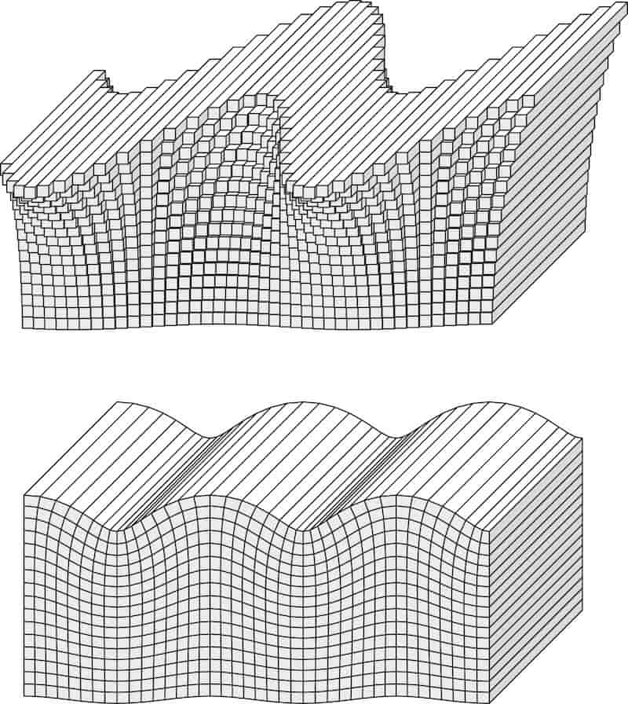

地震波
======

地震波（seismic wave）是在地球内部传播的机械波，由地震、火山喷发、山体滑坡或人为爆炸等震源激发。
地震波分为体波（body wave）和面波（surface wave）。
体波是指在地球内部传播的地震波，而面波指在地球表面附近传播的地震波。
本节将介绍最基础的地震波知识。

体波
-----

分类
^^^^^

体波分为 P 波（\ **p**\ rimary wave 或 P-wave）和 S 波（\ **s**\ econdary wave 或 S-wave）。
P 波比其他地震波传播速度快，最先传播到达台站；S 波的传播速度比 P 波慢，在 P 波后传播到台站。
上述 P 波和 S 波的命名源由主要基于他们到达台站的时间。
从物理属性上来说，P 波是压缩波（compressional wave），因为 P 波在地下介质中传播时，
会造成介质的交替压缩和膨胀，介质的体积发生变化（如下图示）；S 波是剪切波（\ **s**\ hear wave），
因为 S 波在地下介质中传播时，会造成介质的剪切变形，但介质的体积没有变化（如下图示）。

P 波之所以会造成介质的交替压缩和膨胀，是由于介质的运动方向与波传播的方向相同或相反。
因此，P 波是一种纵波（longitudinal wave），即介质的运动方向与波传播的方向相同或相反的波。
S 波之所以会造成介质的剪切变形，是由于介质的运动方向与波传播的方向垂直。
因此，S 波是一种横波（transverse wave），即介质的运动方向与波传播的方向垂直的波。

.. figure:: body-wave-propagation.jpg
   :alt: 体波的介质运动方向以及波传播方向
   :width: 80%
   :align: center

   体波的介质运动方向以及波传播方向。
   引自 `Introduction to Seismology（第三版） <https://www.cambridge.org/us/academic/subjects/earth-and-environmental-science/solid-earth-geophysics/introduction-seismology-3rd-edition?format=HB&isbn=9781316635742>`__
   图 3.2。

波速
^^^^^

尽管地震波是一起产生的，但它们以不同的速度传播。例如，剪切波（S 波）以大约一半的压缩波（P 波）
速度行进地球。地震发生后不久，台站就连续快速关闭了强 P，S 和地面波记录。
较远的台站会在几分钟后记录这些电波的到来，两次到达之间的时间更长。

距地震大约 100 度的距离，P 波和 S 波的传播路径开始接触地球外核的边缘。
超过此距离，第一个到达的波，即 P 波，大小减小，然后消失。穿过外部的 P 波称为 PKP 波。
它们开始出现在 140 度以上。 100 至 140 度之间的距离通常称为“阴影区域”。

我们看不到剪切波（S）穿过外核。因为液体不能被剪切，所以我们推断外核是熔融的。
但是，我们确实看到，波以P波的形式穿过外核，然后在穿过内核时转变为S波。
因为内核确实传递了剪切能，所以我们假设它是固体。

震相
^^^^^

面波
-----

分类
^^^^^

沿着地球表面附近传播的面波也有两种，即瑞利波（Rayleigh wave）和勒夫波（Love wave）。
Rayleigh 波在地表传播时，介质的运动既有与波传播方向相同或相反的分量，又有与波传播方向垂直
的分量（如下图示）。Love 波在地表传播时，介质的运动方向与波传播方向垂直（如下图示）。
面波的振幅随着深度增加会剧烈减少。

   基阶 Love 波（上）和 Rayleigh 波（下）的介质运动方向（假设面波沿着页面从左向右传播）。
   引自 `Introduction to Seismology（第三版） <https://www.cambridge.org/us/academic/subjects/earth-and-environmental-science/solid-earth-geophysics/introduction-seismology-3rd-edition?format=HB&isbn=9781316635742>`__
   图 8.5。

波速
^^^^^

