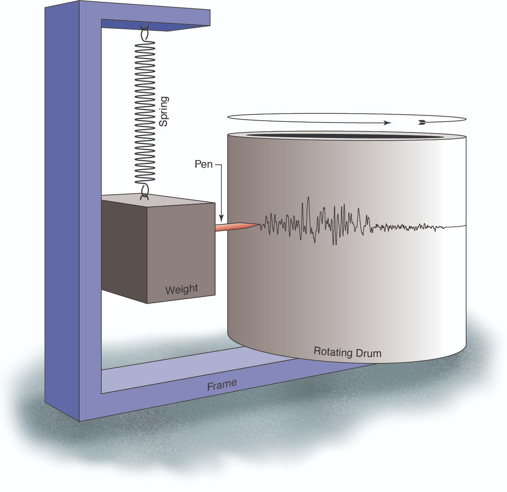

地震仪
======

地震仪是一种用于测量地球运动的设备，由称为地震仪的地面运动检测传感器和数据记录仪的记录系统组成。
记录的地面运动称为地震图。

地震研究中使用的地震仪对地面运动高度敏感，因此可以在非常安静的位置检测到1纳米
（几乎与原子间距一样小的距离）的运动。

   地震仪的原理示意图。引自
   `How Does a Seismometer Work? <https://www.iris.edu/hq/inclass/fact-sheet/how_does_a_seismometer_work>`__\ 。

当地震波到达地震仪时，将记录地面运动并将其转换为数字记录。
这些数据通过蜂窝电话，宽带Internet或卫星通信系统连续传输到数据处理中心。
他们将通过互联网提供给研究人员和公众。

.. figure:: data-transimission.jpg
   :alt: 地震数据记录和传输示意图
   :width: 95%
   :align: center

   地震数据记录和传输示意图。引自
   `How does a seismic station work? <http://www.usarray.org/public/about/how#anchor1>`__\ 。
